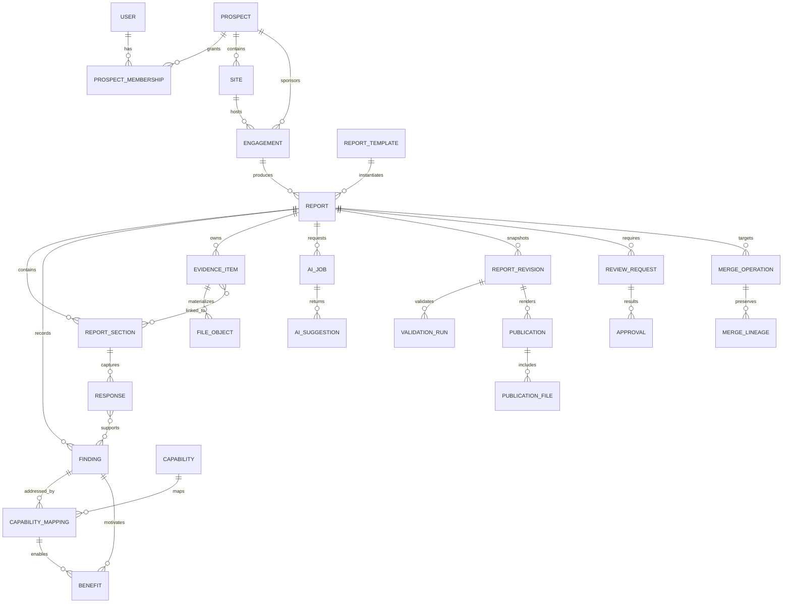

# Document Control

**Document purpose.** This specification defines the complete functional, technical, security, data, AI, document-generation, deployment, and acceptance requirements for an internal web platform used by Sales, Presales, Value Engagement, and reviewers to capture onsite discovery, collaborate, merge field observations, recommend approved Cloud Inventory capabilities, and generate customer-ready reports.

**Primary implementation target.** Production-ready GitHub repository deployed on Render, with responsive use on mobile phones, tablets, and desktop browsers.

**Portability requirement.** Requirements in Sections 1-18 are implementation-agnostic and may be incorporated into an existing website. Sections 19-22 provide the recommended reference implementation and Render deployment model. A team using Claude, another coding assistant, or a different application stack shall preserve the behavioral requirements even where the reference technology is changed.

**Security notice.** The initial administrator credential supplied during discovery is intentionally not reproduced in this specification or repository examples. It shall be configured as a Render secret, stored only as an Argon2id password hash, and changed at first login.

## 0.1 Source Basis and Design Authority

The specification was derived from the following supplied materials:

1. *Discovery - Site Survey Report Denver International Airport* (2026) - primary branding, terminology, report structure, confidentiality treatment, and benchmark output.
2. *Furnware - Discovery Report* (2019) - repeatable Current Process / Future Process / Benefits pattern, inbound-to-shipping process coverage, replenishment, counts, and value proposition.
3. *Donaldsons - Discovery Report* (2022) - manufacturing, raw material, work order, warehouse, and outbound process coverage.
4. *Lonely Planet Site Survey Report* (2018) - methodology, background, operational observations, appendices, site photographs, and RFI content.
5. *UHP Site Survey Report* (2018) - survey objectives, executive value enablers, capability lists, and operational recommendations.
6. *Tappoo Discovery Report* (2021) - multi-site, retail, distribution, manufacturing, field counting, and route-sales context.
7. *Advanced Inventory* (630-page product reference) - controlled source for Cloud Inventory/Nextworld Advanced Inventory functionality, workflows, application prompts, settings, constraints, and terminology.

The Denver report is the visual and structural acceptance benchmark. The older reports expand the discovery question library and operational process coverage. The Advanced Inventory document is a product capability source, not permission to claim every function is configured, licensed, suitable, or in scope for a particular prospect.

## 0.2 Versioning and Change Governance

- This document is the **v1.1 as-built baseline** for software release v0.2.1. Every later change shall update the version, date, author, decision rationale, affected requirements, and migration impact.
- Functional requirements use stable IDs (`FR-*`). Non-functional requirements use `NFR-*`; security requirements use `SEC-*`; AI requirements use `AI-*`; document requirements use `DOC-*`; acceptance criteria use `AC-*`.
- Requirements shall not be silently removed. Deprecated requirements remain in the change log with replacement IDs.
- The application shall display its software version and database schema version on the Admin > System page.

### Change Log

| Version | Date | Status | Summary |
| --- | --- | --- | --- |
| 1.0 | 30 July 2026 | Approved baseline | Initial complete specification based on six discovery reports, Advanced Inventory, and clarified product requirements. |
| 1.1 | 31 July 2026 | As-built staging baseline | Records the validated and live Render staging implementation, deployment corrections, first-login password regression fix, accepted constraints, and canonical enhancement baseline. |

## 0.3 As-Built Release Baseline - Software v0.2.1

This revision records the first successfully validated and live staging build as the canonical enhancement baseline. It does not remove or weaken any requirement in this specification. It distinguishes requirements that are implemented, implemented with a deliberate limitation, or reserved for later enhancement.

### Baseline identity

| Item | Baseline value |
| --- | --- |
| Repository | `campbellhatchard/cloud-inventory-discovery-platform` |
| Live branch | `staging` |
| Locked baseline branch | `baseline-v0.2.1` |
| Baseline commit | `7a36fa0527e97191fa46147e663b59dc8ef282f2` |
| Software release | `0.2.1` |
| Specification release | `1.1` |
| Baseline date | 31 July 2026 |
| Environment | Render staging, Ohio region |
| Runtime | Docker web service and background worker |
| Database | Render PostgreSQL |
| Object storage | Private S3-compatible storage |
| AI status | Disabled by default; confidential AI remains gated |

### Validation and operational proof points

- The complete automated suite passed, including authentication, first-login password change, cross-prospect authorization, collaboration, evidence upload, document generation, validation, retention, deletion, and AI review-state tests.
- DOCX and PDF generation passed with LibreOffice Writer in the application container.
- The Docker image built successfully on Render.
- Alembic migration and seed loading completed through a dedicated Linux pre-deploy script.
- The web service passed `/healthz` and `/readyz` checks and became live.
- The administrator logged in, completed the forced password change, and entered the application successfully after the frontend event-delegation regression was corrected.

### Incorporated stabilization corrections

1. Updated `psycopg[binary]` to `3.2.13` for Python 3.14 Windows validation compatibility while retaining Render/Linux compatibility.
2. Narrowed Ruff to deployment-critical `E` and `F` checks and preserved explicit exclusions rather than scanning virtual-environment dependencies.
3. Made LibreOffice temporary-profile URIs cross-platform using `Path.as_uri()`.
4. Replaced the compound Render pre-deploy string with `scripts/render-predeploy.sh`, which runs migrations and seeding as separate commands.
5. Corrected password-modal event delegation by attaching delegated listeners to `document`, then refreshing authoritative `/api/auth/me` state after a password change.
6. Advanced the service-worker cache and application release identity to `0.2.1`.

### Accepted baseline constraints

The following remain deliberate constraints rather than release defects:

- The application is internal-only.
- Confidential AI is disabled until approved zero-data-retention controls and credentials are configured.
- Antivirus/malware scanning is not bundled.
- PostgreSQL row-level security is not enabled; authorization is enforced in the application and covered by tests.
- Backup and restore, target-device field acceptance, and organization-specific branding/legal approval remain environment and business acceptance activities.
- Production deployment has not yet been approved; staging is the validated proving environment.

### Enhancement change-control rule

All enhancements shall branch from `baseline-v0.2.1` or a descendant that preserves this baseline. Each enhancement shall update the software version, affected requirement IDs, migration impact, security impact, test evidence, deployment instructions, and change log. The baseline branch is not to be force-pushed or used for experimental work.

# 1. Executive Summary

The platform will replace ad hoc Word-document creation with a governed discovery workflow that preserves field evidence, supports multiple contributors, separates prospect data, and produces three controlled outputs:

1. **Full Site Discovery Report** - detailed customer-facing assessment.
2. **Solution Demonstration Brief** - concise scenario and value brief linking observed problems to demonstrable Cloud Inventory functionality.
3. **Customer Follow-up Questionnaire** - unresolved questions and evidence requests generated from gaps, assumptions, and dependencies.

The core information model is not a free-form document. It is a structured evidence graph:

> Observation -> Current Practice -> Problem/Pain -> Operational Impact -> Baseline Evidence -> Approved Capability -> Proposed Future Practice -> Expected Benefit -> Assumption/Dependency -> Human Approval

This chain is essential. It prevents generic solution claims, creates traceability for reviewers, enables reliable document generation, and provides a safe foundation for AI assistance.

The platform will be responsive and field-oriented. Mobile capture emphasizes rapid notes, voice-to-text through the device/browser where available, camera upload, automatic image compression, offline-safe draft queues, and minimal navigation. Desktop views emphasize consolidation, cross-section review, capability mapping, document preview, and publication.

All AI output is advisory. No generated narrative, capability recommendation, benefit, summary, or evidence classification may enter a published report without explicit human approval. AI shall retrieve from a controlled, versioned knowledge base and shall cite its internal source records to the reviewer.

# 2. Objectives, Outcomes, and Success Measures

## 2.1 Business Objectives

- Reduce time from onsite visit to first complete draft.
- Improve consistency across Sales and Presales authors without suppressing expert judgement.
- Capture evidence while it is fresh and prevent loss of photos, notes, exceptions, and customer language.
- Link solution recommendations to observed customer problems rather than using generic capability lists.
- Reduce unsupported promises and inconsistent product terminology.
- Enable parallel contribution, accountable review, controlled merge, revision history, and publication.
- Reuse approved knowledge from prior discovery reports without exposing one prospect's confidential data to another.
- Produce professionally formatted DOCX and PDF outputs that meet the Denver report benchmark.

## 2.2 Product Outcomes

| Outcome | Target measure at production acceptance |
| --- | --- |
| Field usability | A contributor can create a report, select a process, enter an observation, take/upload a photo, caption it, and save in under 90 seconds on a current mobile browser. |
| Autosave resilience | No more than 10 seconds of typed work is at risk during an ordinary connection loss or browser interruption. |
| Collaboration | Multiple reports can be assigned to one prospect/site and merged by an owner with a conflict preview and source traceability. |
| Report quality | Every published statement can be traced to authored evidence, an approved AI suggestion, or an approved capability record. |
| Publication | Draft DOCX/PDF and final DOCX/PDF are generated asynchronously with status, error handling, and immutable publication snapshots. |
| Isolation | A user without access to Prospect A cannot retrieve Prospect A data, object keys, search results, AI context, or generated documents. |
| Governance | Final publication is blocked until required validation passes or the owner removes non-applicable sections with a recorded reason. |
| Portability | A clean deployment can be created from GitHub using the supplied Render Blueprint and documented secrets. |

## 2.3 Out of Scope for v1.0

- Customer self-service portal or external customer authentication.
- Native iOS/Android applications; responsive PWA behavior is required instead.
- Automatic commercial pricing, proposal, contract, or implementation estimate generation.
- Unattended publication of AI-generated content.
- General-purpose CRM replacement.
- Real-time co-editing at the keystroke level; optimistic section-level collaboration is sufficient.
- Product configuration validation against a live Cloud Inventory tenant.
- Training a custom foundation model on prospect data.

# 3. Assumptions, Counterarguments, and Critical Risks

## 3.1 Key Assumptions

1. The application is internal-only during v1.0.
2. Users will have intermittent but generally available internet during field visits; a resilient local draft queue is required, not a fully offline multi-day application.
3. The Denver report branding can be used as the initial default and will later be administered in the application.
4. The organization can provision Render Postgres, object storage, and an OpenAI API project that satisfies approved data controls.
5. Product experts will curate and approve the initial capability catalog and subsequent knowledge growth.
6. Customer logos and site photographs are lawfully collected and may be used in internal drafting and approved customer outputs.

## 3.2 Strongest Counterargument

A structured application can become slower than a blank document and can create false confidence through checklists and AI-generated prose. This is a valid risk. The design therefore uses progressive disclosure, quick capture, optional prompts, free-form notes, reusable process templates, owner-controlled section applicability, and explicit evidence/approval states. The application must help experts think; it must not force them to complete irrelevant bureaucracy.

## 3.3 Principal Failure Modes

| Failure mode | Consequence | Required control |
| --- | --- | --- |
| AI invents or overstates functionality | Commercial and delivery risk | Controlled capability catalog, source references, confidence, human approval, product-owner governance. |
| Cross-prospect information leakage | Severe confidentiality breach | Tenant/prospect authorization on every query, isolated object keys, scoped retrieval, security tests, audit log. |
| Field workflow is cumbersome | Users return to notes and Word | Mobile-first quick capture, autosave, camera-first attachments, minimal required fields onsite. |
| Report output breaks across images/pages | Customer-facing quality failure | Dedicated document worker, deterministic templates, image normalization, preview, regression fixtures. |
| Repository knowledge becomes polluted | Repeated poor recommendations | Draft/proposed/approved/rejected lifecycle, provenance, effective dates, reviewer role. |
| Owner merges reports destructively | Evidence loss | Merge preview, immutable source snapshot, lineage, recovery hold before hard deletion. |
| Initial password is hardcoded | Credential compromise | Secret-only bootstrap, hash, first-login change, no credential in repository. |
| Default AI retention exceeds policy | Policy breach | Disable confidential AI until approved retention controls; use `store=false`, minimal data, and approved project settings. |

# 4. Users, Roles, Permissions, and Segregation of Duties

## 4.1 Roles

| Role | Purpose | Core permissions |
| --- | --- | --- |
| Contributor | Capture onsite evidence and draft assigned sections. | Create own capture reports; edit assigned sections; upload attachments; submit sections; review own AI suggestions; cannot publish or delete sections. |
| Report Owner | Accountable author and consolidator for a prospect/site report. | Create reports; invite/assign contributors; add/reorder/remove sections; merge reports; resolve conflicts; approve narrative; request review; generate drafts; submit final. |
| Reviewer/Approver | Independent quality, solution, or commercial review. | Comment, request changes, approve/reject sections and capability claims; compare versions; approve final publication if designated. |
| Administrator | System and content administration. | Manage users, roles, templates, branding, prompts, capability catalog, AI settings, retention, audit, system health, and bootstrap configuration. |

A user may hold more than one role. Role possession does not grant access to all prospects; access is also controlled by explicit prospect/report membership.

## 4.2 Permission Rules

- Only the Report Owner may remove a report section. Removal requires a reason and is audited.
- Contributors may add optional/ad hoc sections if enabled by the owner; the owner controls final ordering and inclusion.
- Only an Owner or Administrator may merge reports.
- Only a designated Reviewer/Approver or Owner with configured self-approval permission may approve a section.
- Final publication requires an Owner and at least one Reviewer/Approver unless an Administrator explicitly configures a lower-risk workflow.
- Administrators may administer platform content but shall not automatically see prospect content. A separate `support_access` grant, reason, and expiry are required for emergency access.
- No role may edit an immutable published snapshot. Corrections create a new revision.

## 4.3 Access Matrix

| Action | Contributor | Owner | Reviewer | Administrator |
| --- | --- | --- | --- | --- |
| Create prospect | Optional by policy | Yes | No | Yes |
| Create capture report | Yes | Yes | No | Yes |
| Edit assigned section | Yes | Yes | Comment only | Only with support access |
| Upload evidence | Yes | Yes | Comment only | Only with support access |
| Add section | When allowed | Yes | No | Template administration |
| Remove section | No | Yes with reason | Recommend only | Template administration or support access |
| Merge reports | No | Yes | Review merge | Yes with support access |
| Approve AI suggestion | Own/assigned draft | Yes | Yes | Catalog administration only |
| Generate draft | When allowed | Yes | Yes | Yes with support access |
| Publish final | No | Submit/Publish by policy | Approve/Publish by policy | Emergency only |
| Manage capability catalog | No | Propose | Approve if Product Reviewer | Yes |
| Manage branding and templates | No | No | No | Yes |
| View audit log | Own activity | Report activity | Report activity | System-wide |

# 5. Core Domain Model and Lifecycle

## 5.1 Hierarchy

- **Organization/Tenant** - Cloud Inventory internal organization in v1; retained to support future multi-tenant operation.
- **Prospect** - isolated confidentiality boundary for a company/opportunity.
- **Site** - physical operational location belonging to a prospect.
- **Engagement** - discovery initiative that may cover one or more sites and dates.
- **Capture Report** - a contributor/owner's structured field report for one engagement/site.
- **Merged Report** - consolidated working report containing lineage to source reports.
- **Section** - ordered document component created from a template or ad hoc.
- **Process Assessment** - standardized operational section with evidence, current state, future state, and benefits.
- **Response** - structured or free-form answer to a prompt.
- **Evidence Item** - photo, document, diagram, spreadsheet, screenshot, recording, transcript, or link.
- **Finding** - normalized problem, observation, positive practice, risk, opportunity, or open question.
- **Capability Mapping** - relationship between a finding and an approved/proposed Cloud Inventory capability.
- **Benefit Statement** - qualitative or quantified expected outcome with baseline and assumptions.
- **AI Suggestion** - immutable proposed content with prompt context, model metadata, sources, and decision.
- **Publication** - immutable generated DOCX/PDF snapshot and validation record.

## 5.2 Report State Machine

`Draft -> Submitted for Merge/Review -> In Review -> Changes Requested -> Approved for Publication -> Finalized -> Archived -> Retention Hold -> Deleted`

Additional states:

- `Merged Source` - source report incorporated into a target and hidden from normal active lists.
- `Generation Failed` - document job failed; working report remains editable.
- `Superseded` - final publication replaced by a later final revision.

State transitions shall be permission-controlled, timestamped, and audited.

## 5.3 Section State Machine

`Not Started -> In Progress -> Contributor Complete -> Owner Reviewed -> Reviewer Approved`

A section may also be `Not Applicable`, `Removed`, or `Changes Requested`. Final validation treats `Not Applicable` and `Removed` as complete only when an owner reason is recorded.

## 5.4 AI Suggestion State Machine

`Generated -> Pending Review -> Edited -> Approved` or `Rejected` or `Superseded`.

Approved text shall retain a link to the original AI output and any human edits. Rejecting a suggestion shall optionally capture a reason to improve prompt and catalog governance.

# 6. End-to-End User Workflows

## 6.1 Create and Prepare an Engagement

1. Owner creates or selects a prospect.
2. Owner creates site(s), engagement dates, opportunity context, host systems, and expected attendees.
3. Owner selects a report template and relevant operational modules.
4. System recommends additional modules based on initial profile answers; owner accepts or declines each recommendation.
5. Owner invites contributors and assigns sections/processes.
6. Each contributor may create a separate capture report or collaborate in the shared working report.
7. Application preloads mobile quick-capture cards and optional question prompts.

## 6.2 Mobile Field Capture

1. User opens engagement dashboard and taps an assigned process.
2. User records a quick note, selects finding type, and optionally adds impact/confidence.
3. User takes one or more photos; the application uploads a compressed derivative immediately and retains the full-quality original according to policy.
4. User adds a caption by typing or device voice-to-text.
5. Autosave confirms local and server status. If offline, the card is queued and clearly marked.
6. User can expand structured prompts only when useful.
7. User can flag a follow-up question, capability idea, risk, or customer quote.

## 6.3 Post-Visit Consolidation

1. Contributors complete assigned structured questions and submit sections.
2. Owner reviews report completeness and creates/updates findings.
3. Owner runs AI assistance for summarization, missing questions, contradictions, capability candidates, future-state narrative, benefits, and executive summary.
4. Each AI suggestion is reviewed, edited as needed, and approved or rejected.
5. Owner requests specialist review for product, integration, security, commercial, or value claims.
6. Owner generates a draft DOCX/PDF with `DRAFT - CONFIDENTIAL` watermark.

## 6.4 Merge Multiple Reports

1. Owner selects reports within the same prospect and engagement.
2. System validates that all source reports share the same prospect boundary.
3. Merge preview groups sections by template key and displays unique, duplicate, and conflicting responses.
4. The owner chooses target ordering and resolves conflicts at response/finding level.
5. Photos and attachments are deduplicated by checksum but preserve all source captions and lineage.
6. The system creates a new merged revision; source reports become `Merged Source` and are removed from normal active lists.
7. Source records enter a 30-day encrypted recovery hold before hard deletion, unless legal/retention policy requires longer.

## 6.5 Finalize and Publish

1. Owner runs final validation.
2. Missing required content, unresolved contradictions, unapproved AI content, missing source evidence, and incomplete reviews are listed by section.
3. Owner may complete the gap or remove an irrelevant section with a reason.
4. Required reviewers approve.
5. System generates immutable final DOCX and PDF without draft watermark.
6. Publication record stores template/branding versions, content hash, generated file hashes, approvals, and validation results.
7. Later changes create a new report revision and publication version.

## 6.6 Retention and Archival

- At 30 months, owner and administrator receive an upcoming-retention notification.
- At 35 months, the system prompts export/archive and confirms the scheduled deletion date.
- At 36 months, records are archived or deleted according to configured legal hold and policy.
- Drafts may be permanently deleted by an Owner or Administrator after a typed confirmation; deletion is audited.
- Archive export includes structured JSON, DOCX/PDF publications, evidence manifest, audit extract, and original/derivative files as configured.

# 7. Information Architecture and Screen Specification

## 7.1 Global Navigation

Desktop: left navigation with Dashboard, Prospects, Engagements, Reports, Reviews, Knowledge, Publications, and Admin (role-dependent).

Mobile: bottom navigation for Home, Capture, Reports, Tasks, and More. The active engagement remains pinned for one-tap return.

## 7.2 Required Screens

| Screen | Primary users | Required behavior |
| --- | --- | --- |
| Sign In | All | Username/password, rate limiting, lockout messaging, password reset, forced first-login password change. |
| Dashboard | All | Assigned actions, recent reports, pending sync, review queue, generation jobs, retention alerts. |
| Prospect List/Detail | Owner/Admin | Search, status, sites, engagements, users, reports, publications, retention status. |
| Engagement Setup | Owner | Site/date/attendees/objectives, process selector, assignments, customer logo, baseline questions. |
| Mobile Quick Capture | Contributor | Camera-first cards, note, finding type, caption, process tag, local queue status, large touch targets. |
| Report Workspace | Contributor/Owner | Section navigator, progress, structured prompts, free-form editor, evidence rail, findings, AI actions, comments. |
| Process Assessment | Contributor/Owner | Standard subsections, prompt accordion, current/future/benefit views, baseline metrics, capability mapping. |
| Merge Center | Owner | Source selection, duplicate/conflict groups, side-by-side response comparison, lineage, merge preview. |
| Review Center | Reviewer | Review queue, evidence trace, AI provenance, compare revisions, comment/request/approve actions. |
| Validation Center | Owner/Reviewer | Errors/warnings grouped by section; navigate to issue; remove section with reason; draft/final readiness. |
| Document Preview | Owner/Reviewer | Page thumbnails, selected output type, watermark state, image layout, regenerate, download history. |
| Capability Catalog | Admin/Product Reviewer | Source, version, applicability, prerequisites, approved wording, benefits, evidence, lifecycle. |
| Knowledge Source Admin | Admin | Import reports/reference docs, classify prospect/global scope, parse status, approve extracted candidates. |
| Prompt/Template Admin | Admin | Report templates, process modules, questions, required flags, conditional logic, output mapping. |
| Branding Admin | Admin | Logos, fonts, colors, margins, confidentiality, headers/footers, watermark, preview/test generation. |
| User and Access Admin | Admin | Users, roles, prospect memberships, reset/MFA readiness, access review. |
| Audit and System Health | Admin | Audit search/export, failed jobs, AI usage, storage, database, version, retention jobs. |

## 7.3 Responsive and Accessibility Requirements

- Breakpoints are behavior-based, not device-specific. Minimum supported viewport width: 320 CSS pixels.
- Touch targets shall be at least 44 by 44 CSS pixels.
- Mobile forms use one primary action per screen and avoid multi-column tables.
- Long process sections use sticky progress, collapsible subsections, and next/previous controls.
- Users can complete all core workflows with keyboard only on desktop.
- Labels, errors, status, and approval state shall not rely on color alone.
- Uploaded images require captions; alt text defaults from caption and can be edited.
- The application shall target WCAG 2.2 AA for internal web screens and accessible heading/table structures in DOCX/PDF where technically practical.

## 7.4 Autosave and Offline-Safe Capture

- Text fields save locally after 500 ms idle and server-side after 2 seconds idle or on field exit.
- Each editor displays `Saved`, `Saving`, `Offline - queued`, or `Conflict` status.
- A service worker and IndexedDB queue store unsent capture events and attachment metadata.
- The queue retries with exponential backoff when connectivity returns.
- Local storage is encrypted where browser platform support permits; users are warned not to use shared devices.
- v1 offline scope includes new notes, responses, finding cards, and photo upload queue. Complex merge, AI, review, and document generation require connectivity.
- Server changes use optimistic concurrency with a version/ETag. Conflicts open a non-destructive comparison rather than overwriting content.

# 8. Report Templates and Canonical Content Structure

## 8.1 Full Site Discovery Report Default Structure

1. Cover Page
2. Confidentiality Statement
3. Document Revision History
4. Table of Contents
5. Opportunity Overview
6. Company and Site Profile
7. Products and Materials Handled
8. Operational Footprint and Distribution Network
9. Master Data
10. IT and Systems Landscape
11. Survey Background and Attendees
12. Site Survey Objectives
13. Executive Summary
14. Vision, Pain Points, and Desired Outcomes
15. Cloud Inventory Solution Viability
16. General Operational Observations
17. Operational Process Assessments
18. Cross-Process Findings and Dependencies
19. Recommended Cloud Inventory Capabilities
20. Expected Benefits and Baselines
21. Risks, Assumptions, and Prerequisites
22. Recommended Next Steps
23. Supporting Evidence and Attachments
24. Appendix and Site Photographs

The report owner may add and reorder sections. Contributors may add sections when the owner enables that permission. Only the owner may remove a section. Templates define defaults, not a rigid customer report.

## 8.2 Solution Demonstration Brief Structure

1. Prospect and engagement context
2. Customer priorities and desired outcomes
3. Demonstration audience and roles
4. Top observed problems, evidence, and impacts
5. Demonstration scenarios ordered by customer value
6. For each scenario: current problem, Cloud Inventory capability, proposed workflow, value statement, proof point, constraints, and questions to validate
7. Integration and master-data assumptions
8. Items explicitly out of scope or not to demonstrate
9. Recommended close and next actions

## 8.3 Customer Follow-up Questionnaire Structure

1. Purpose and requested response date
2. Questions grouped by process/system/topic
3. Reason the information is required
4. Expected answer type and supporting evidence request
5. Priority: Critical / Important / Useful
6. Owner/contact requested from the customer
7. Existing assumption that will remain unless corrected

## 8.4 Standard Process Assessment Schema

Every selected operational process shall support the following subsections:

1. Process purpose and boundary
2. Participants and roles
3. Trigger, inputs, and preconditions
4. Current process steps
5. Systems, devices, forms, labels, and documents used
6. Inventory, order, and master data captured
7. Volumes, frequencies, peaks, and service levels
8. Current controls and positive practices
9. Exceptions, workarounds, and dependencies
10. Pain points and root-cause hypotheses
11. Operational, customer, compliance, safety, and financial impact
12. Measurable baseline data
13. Photographic and documentary evidence
14. Cloud Inventory functionality candidates
15. Proposed future process
16. Expected qualitative benefits
17. Quantified benefit hypothesis, calculation, and confidence
18. Assumptions, prerequisites, limitations, and integration dependencies
19. Open questions and follow-up evidence
20. Confidence and review status

Fields may be hidden when irrelevant, but the underlying schema remains consistent so content can be compared and merged.

## 8.5 Finding Types

- Observation
- Positive Practice
- Problem/Pain Point
- Root-Cause Hypothesis
- Risk
- Compliance or Safety Concern
- Customer Quote
- Requirement
- Future Requirement
- Opportunity
- Capability Candidate
- Assumption
- Dependency
- Open Question
- Baseline Metric
- Benefit Hypothesis

# 9. Discovery Question Library

The question library is administered content. Each prompt has an ID, process, subsection, answer type, required/optional flag, field/mobile priority, conditional display rule, help text, examples, output mapping, and version. The questions below are the v1 baseline. They are prompts for expert discovery, not a mandatory interrogation script.

## 9.1 Receiving

- What is the purpose of this process and where does it begin and end?
- Who performs, supervises, approves, or depends on the process?
- What event triggers the process and what inputs must be available?
- Describe the actual steps observed, including sequence, handoffs, queues, and waiting.
- Which systems, screens, spreadsheets, paper forms, labels, scanners, printers, or devices are used?
- What information is captured, by whom, at what point, and how is it validated?
- What volumes, frequencies, seasonal peaks, cut-off times, and service targets apply?
- What is working well and should be preserved?
- Which exceptions, workarounds, rework loops, or supervisor interventions occur?
- Where do errors, delays, searching, duplicate entry, congestion, or lost visibility occur?
- What is the operational/customer/safety/compliance/financial effect of the problem?
- What baseline evidence exists and what additional measurement is needed?
- Which photos, forms, labels, screenshots, maps, or reports demonstrate the current practice?
- What future outcome does the prospect want, and how would success be measured?
- What assumptions, integration dependencies, policy constraints, or physical constraints must be validated?
- What inbound order types are received: purchase, transfer, customer return, non-stock, miscellaneous, or third-party goods?
- How are appointments, vehicles, security, dock access, and unloading coordinated?
- How is expected-versus-received quantity verified and how are overages, shortages, damage, and substitutions handled?
- Which item, supplier, alternate, GTIN, lot, serial, expiry, owner, job, country-of-origin, or UOM identifiers are captured?
- Where is inventory staged after receipt and when does it become available?
- Are inspections, quarantine, quality dispositions, holds, or document approvals required?
- How are labels, license plates/IHUs, receipt documents, and third-party notifications produced?
- How long is dock-to-system receipt and dock-to-stock, and what causes variance?

## 9.2 Putaway

- What is the purpose of this process and where does it begin and end?
- Who performs, supervises, approves, or depends on the process?
- What event triggers the process and what inputs must be available?
- Describe the actual steps observed, including sequence, handoffs, queues, and waiting.
- Which systems, screens, spreadsheets, paper forms, labels, scanners, printers, or devices are used?
- What information is captured, by whom, at what point, and how is it validated?
- What volumes, frequencies, seasonal peaks, cut-off times, and service targets apply?
- What is working well and should be preserved?
- Which exceptions, workarounds, rework loops, or supervisor interventions occur?
- Where do errors, delays, searching, duplicate entry, congestion, or lost visibility occur?
- What is the operational/customer/safety/compliance/financial effect of the problem?
- What baseline evidence exists and what additional measurement is needed?
- Which photos, forms, labels, screenshots, maps, or reports demonstrate the current practice?
- What future outcome does the prospect want, and how would success be measured?
- What assumptions, integration dependencies, policy constraints, or physical constraints must be validated?
- How is the destination selected: fixed, operator knowledge, printed instruction, suggested, or system-directed?
- What location, zone, capacity, mixing, owner, lot, status, temperature, security, and equipment rules apply?
- Is inventory moved loose, on a pallet/license plate/IHU, in a cart, or through cross-dock?
- How are from/to locations and inventory identity confirmed?
- How are overflow, reserve, temporary, blocked, or full locations handled?
- What is receipt-to-putaway time, travel distance, and frequency of incorrect location placement?

## 9.3 Transfer

- What is the purpose of this process and where does it begin and end?
- Who performs, supervises, approves, or depends on the process?
- What event triggers the process and what inputs must be available?
- Describe the actual steps observed, including sequence, handoffs, queues, and waiting.
- Which systems, screens, spreadsheets, paper forms, labels, scanners, printers, or devices are used?
- What information is captured, by whom, at what point, and how is it validated?
- What volumes, frequencies, seasonal peaks, cut-off times, and service targets apply?
- What is working well and should be preserved?
- Which exceptions, workarounds, rework loops, or supervisor interventions occur?
- Where do errors, delays, searching, duplicate entry, congestion, or lost visibility occur?
- What is the operational/customer/safety/compliance/financial effect of the problem?
- What baseline evidence exists and what additional measurement is needed?
- Which photos, forms, labels, screenshots, maps, or reports demonstrate the current practice?
- What future outcome does the prospect want, and how would success be measured?
- What assumptions, integration dependencies, policy constraints, or physical constraints must be validated?
- Which transfers occur: bin-to-bin, warehouse-to-warehouse, owner/job change, replenishment, staging, field, or intercompany?
- What authorizes the transfer and when is an order required?
- How are in-transit status, shipment, receipt confirmation, loss, damage, and partial quantities handled?
- Can intact handling units be moved and are nested containers used?
- What location/warehouse restrictions, reason codes, and audit requirements apply?
- How are urgent or unplanned movements recorded?

## 9.4 Order Management

- What is the purpose of this process and where does it begin and end?
- Who performs, supervises, approves, or depends on the process?
- What event triggers the process and what inputs must be available?
- Describe the actual steps observed, including sequence, handoffs, queues, and waiting.
- Which systems, screens, spreadsheets, paper forms, labels, scanners, printers, or devices are used?
- What information is captured, by whom, at what point, and how is it validated?
- What volumes, frequencies, seasonal peaks, cut-off times, and service targets apply?
- What is working well and should be preserved?
- Which exceptions, workarounds, rework loops, or supervisor interventions occur?
- Where do errors, delays, searching, duplicate entry, congestion, or lost visibility occur?
- What is the operational/customer/safety/compliance/financial effect of the problem?
- What baseline evidence exists and what additional measurement is needed?
- Which photos, forms, labels, screenshots, maps, or reports demonstrate the current practice?
- What future outcome does the prospect want, and how would success be measured?
- What assumptions, integration dependencies, policy constraints, or physical constraints must be validated?
- Which outbound order types exist and where are they created?
- How do orders enter the warehouse system and how often are they synchronized?
- How are allocation, reservation, priority, hold, release, cut-off, route, customer, and ship-date decisions made?
- Are partial allocations, backorders, substitutions, short shipment, cancellations, or changes allowed?
- How are waves/batches created, sequenced, released, and monitored?
- What administration and supervisor effort is required before work reaches operators?

## 9.5 Picking

- What is the purpose of this process and where does it begin and end?
- Who performs, supervises, approves, or depends on the process?
- What event triggers the process and what inputs must be available?
- Describe the actual steps observed, including sequence, handoffs, queues, and waiting.
- Which systems, screens, spreadsheets, paper forms, labels, scanners, printers, or devices are used?
- What information is captured, by whom, at what point, and how is it validated?
- What volumes, frequencies, seasonal peaks, cut-off times, and service targets apply?
- What is working well and should be preserved?
- Which exceptions, workarounds, rework loops, or supervisor interventions occur?
- Where do errors, delays, searching, duplicate entry, congestion, or lost visibility occur?
- What is the operational/customer/safety/compliance/financial effect of the problem?
- What baseline evidence exists and what additional measurement is needed?
- Which photos, forms, labels, screenshots, maps, or reports demonstrate the current practice?
- What future outcome does the prospect want, and how would success be measured?
- What assumptions, integration dependencies, policy constraints, or physical constraints must be validated?
- Which methods are used: single order, batch, wave, zone, cluster/cart, full pallet, case, each, work order, or field pick?
- How are operators directed and how is travel sequence determined?
- How are item, location, lot/serial, UOM, owner, job, and quantity validated?
- Where is picked inventory placed: tote/IHU, cart, pallet, pack location, staging, technician counter, or vehicle?
- How are shorts, unexpected inventory, damaged product, overrides, and replenishment triggers handled?
- What are lines/hour, travel time, error rate, re-picks, and supervisor intervention?

## 9.6 Packing

- What is the purpose of this process and where does it begin and end?
- Who performs, supervises, approves, or depends on the process?
- What event triggers the process and what inputs must be available?
- Describe the actual steps observed, including sequence, handoffs, queues, and waiting.
- Which systems, screens, spreadsheets, paper forms, labels, scanners, printers, or devices are used?
- What information is captured, by whom, at what point, and how is it validated?
- What volumes, frequencies, seasonal peaks, cut-off times, and service targets apply?
- What is working well and should be preserved?
- Which exceptions, workarounds, rework loops, or supervisor interventions occur?
- Where do errors, delays, searching, duplicate entry, congestion, or lost visibility occur?
- What is the operational/customer/safety/compliance/financial effect of the problem?
- What baseline evidence exists and what additional measurement is needed?
- Which photos, forms, labels, screenshots, maps, or reports demonstrate the current practice?
- What future outcome does the prospect want, and how would success be measured?
- What assumptions, integration dependencies, policy constraints, or physical constraints must be validated?
- Is packing a distinct validation step or only physical consolidation?
- How are cartons/outbound packing units selected, created, weighed, dimensioned, nested, and closed?
- How are serials, lots, UOM, quantities, documents, compliance inserts, and special instructions validated?
- Are cartonization, check-weighing, value-added services, or customer-specific labeling needed?
- How are packing errors, repacks, shortages, damages, and unpack/rework handled?
- What is pick-to-pack and pack-to-ship time?

## 9.7 Shipping

- What is the purpose of this process and where does it begin and end?
- Who performs, supervises, approves, or depends on the process?
- What event triggers the process and what inputs must be available?
- Describe the actual steps observed, including sequence, handoffs, queues, and waiting.
- Which systems, screens, spreadsheets, paper forms, labels, scanners, printers, or devices are used?
- What information is captured, by whom, at what point, and how is it validated?
- What volumes, frequencies, seasonal peaks, cut-off times, and service targets apply?
- What is working well and should be preserved?
- Which exceptions, workarounds, rework loops, or supervisor interventions occur?
- Where do errors, delays, searching, duplicate entry, congestion, or lost visibility occur?
- What is the operational/customer/safety/compliance/financial effect of the problem?
- What baseline evidence exists and what additional measurement is needed?
- Which photos, forms, labels, screenshots, maps, or reports demonstrate the current practice?
- What future outcome does the prospect want, and how would success be measured?
- What assumptions, integration dependencies, policy constraints, or physical constraints must be validated?
- How are shipments created, consolidated, manifested, staged, loaded, and confirmed?
- Which carriers, parcel/TMS systems, routes, customer pickups, or internal vehicles are used?
- What labels, bills of lading, packing lists, tracking numbers, seals, and compliance documents are required?
- How are freight rates/service levels selected and returned to the host system?
- How are load verification, missed cartons, short shipment, partial shipment, and proof of dispatch managed?
- What is on-time dispatch performance and where do queues occur?

## 9.8 Cycle Count Management

- What is the purpose of this process and where does it begin and end?
- Who performs, supervises, approves, or depends on the process?
- What event triggers the process and what inputs must be available?
- Describe the actual steps observed, including sequence, handoffs, queues, and waiting.
- Which systems, screens, spreadsheets, paper forms, labels, scanners, printers, or devices are used?
- What information is captured, by whom, at what point, and how is it validated?
- What volumes, frequencies, seasonal peaks, cut-off times, and service targets apply?
- What is working well and should be preserved?
- Which exceptions, workarounds, rework loops, or supervisor interventions occur?
- Where do errors, delays, searching, duplicate entry, congestion, or lost visibility occur?
- What is the operational/customer/safety/compliance/financial effect of the problem?
- What baseline evidence exists and what additional measurement is needed?
- Which photos, forms, labels, screenshots, maps, or reports demonstrate the current practice?
- What future outcome does the prospect want, and how would success be measured?
- What assumptions, integration dependencies, policy constraints, or physical constraints must be validated?
- How are counts selected: annual, ad hoc, ABC, location, item, variance-triggered, or event-triggered?
- Are counts blind or directed, and can operations continue during counting?
- How are loose, lot, serial, and handling-unit inventory counted?
- How are unexpected/missing inventory, recounts, approvals, reason codes, and ERP adjustments managed?
- Who investigates variances and what transaction/user/location history is available?
- What are count effort, operational downtime, variance rate, adjustment value, and location accuracy?

## 9.9 Work Orders

- What is the purpose of this process and where does it begin and end?
- Who performs, supervises, approves, or depends on the process?
- What event triggers the process and what inputs must be available?
- Describe the actual steps observed, including sequence, handoffs, queues, and waiting.
- Which systems, screens, spreadsheets, paper forms, labels, scanners, printers, or devices are used?
- What information is captured, by whom, at what point, and how is it validated?
- What volumes, frequencies, seasonal peaks, cut-off times, and service targets apply?
- What is working well and should be preserved?
- Which exceptions, workarounds, rework loops, or supervisor interventions occur?
- Where do errors, delays, searching, duplicate entry, congestion, or lost visibility occur?
- What is the operational/customer/safety/compliance/financial effect of the problem?
- What baseline evidence exists and what additional measurement is needed?
- Which photos, forms, labels, screenshots, maps, or reports demonstrate the current practice?
- What future outcome does the prospect want, and how would success be measured?
- What assumptions, integration dependencies, policy constraints, or physical constraints must be validated?
- Which work order types consume, reserve, kit, repair, produce, or return inventory?
- How are material requirements created, allocated, picked, staged, issued, returned, and closed?
- Are owner, job, job cost code, asset, technician, operation, or cost center captured?
- How are shortages, substitutions, emergency issues, non-stock items, cores/repairables, and unused materials handled?
- Are materials issued manually, preflushed, backflushed, at pay points, or treated as floor stock?
- What effect does material availability/searching have on technician wrench time or production uptime?

## 9.10 Field Inventory

- What is the purpose of this process and where does it begin and end?
- Who performs, supervises, approves, or depends on the process?
- What event triggers the process and what inputs must be available?
- Describe the actual steps observed, including sequence, handoffs, queues, and waiting.
- Which systems, screens, spreadsheets, paper forms, labels, scanners, printers, or devices are used?
- What information is captured, by whom, at what point, and how is it validated?
- What volumes, frequencies, seasonal peaks, cut-off times, and service targets apply?
- What is working well and should be preserved?
- Which exceptions, workarounds, rework loops, or supervisor interventions occur?
- Where do errors, delays, searching, duplicate entry, congestion, or lost visibility occur?
- What is the operational/customer/safety/compliance/financial effect of the problem?
- What baseline evidence exists and what additional measurement is needed?
- Which photos, forms, labels, screenshots, maps, or reports demonstrate the current practice?
- What future outcome does the prospect want, and how would success be measured?
- What assumptions, integration dependencies, policy constraints, or physical constraints must be validated?
- Where is field inventory held: technician, truck, van, job site, customer site, consignment, route, or remote store?
- How is inventory assigned, transferred, replenished, counted, consumed, adjusted, and returned?
- Which transactions must work without connectivity and how long can devices remain offline?
- How are device/user/site conflicts and duplicate offline submissions resolved?
- What proof, reason code, customer/job/asset reference, location, photo, or signature is required?
- What are shrinkage, stockout, emergency purchase, return, and technician travel baselines?

## 9.11 Manufacturing

- What is the purpose of this process and where does it begin and end?
- Who performs, supervises, approves, or depends on the process?
- What event triggers the process and what inputs must be available?
- Describe the actual steps observed, including sequence, handoffs, queues, and waiting.
- Which systems, screens, spreadsheets, paper forms, labels, scanners, printers, or devices are used?
- What information is captured, by whom, at what point, and how is it validated?
- What volumes, frequencies, seasonal peaks, cut-off times, and service targets apply?
- What is working well and should be preserved?
- Which exceptions, workarounds, rework loops, or supervisor interventions occur?
- Where do errors, delays, searching, duplicate entry, congestion, or lost visibility occur?
- What is the operational/customer/safety/compliance/financial effect of the problem?
- What baseline evidence exists and what additional measurement is needed?
- Which photos, forms, labels, screenshots, maps, or reports demonstrate the current practice?
- What future outcome does the prospect want, and how would success be measured?
- What assumptions, integration dependencies, policy constraints, or physical constraints must be validated?
- What products, raw materials, intermediates/WIP, co-products, by-products, and finished goods are managed?
- How are BOMs, routings, work centers, operations, schedules, and work orders defined?
- How are raw materials reserved, staged, issued, substituted, returned, and traced?
- How are production completions, over/under completion, scrap, quality, lots/serials, and expiry captured?
- Which issue methods are used: manual, preflush, backflush at pay point/final pay point, floor stock, or non-stock?
- How are WIP locations, handling units, job/cost, labor, downtime, and consumption variances controlled?

## 9.12 Cross-Process and Enterprise Questions

- Where is the system of record for item, location, inventory, order, supplier, customer, asset, work order, cost, and financial data?
- Which integrations are real time, near real time, batch, manual upload, or unavailable?
- What event ownership and reconciliation rules apply when systems disagree?
- Which spreadsheets or local databases operate as unofficial systems of record?
- What barcode symbologies, alternate codes, label formats, printers, mobile devices, wireless coverage, and security constraints exist?
- What master-data quality problems would prevent scanning, allocation, directed movement, or reporting?
- What reporting, dashboards, alerts, KPIs, and labor visibility are unavailable today?
- What physical constraints—space, occupancy, aisle widths, storage automation, MHE, temperature, airside/security, or hazardous materials—constrain the future process?
- What regulatory, safety, audit, recall, chain-of-custody, or customer-specific controls are required?
- Which processes are intentionally flexible and should not be over-automated?
- Which improvements can be implemented with configuration and which require integration, data remediation, physical change, policy change, or custom development?
- What is the phased adoption path and which capability creates the earliest defensible proof point?

## 9.13 Baseline Metric Library

The platform shall provide optional baseline cards with value, unit, period, source, sample size, confidence, and notes. Standard metrics include:

- Dock-to-receipt and dock-to-stock time
- Receiving lines/hour and discrepancy rate
- Putaway travel/time and wrong-location rate
- Inventory location accuracy and inventory value variance
- Search/investigation time
- Cycle count labor, downtime, variance, recounts, and adjustments
- Replenishment response time and stockout frequency
- Picks/hour, lines/hour, travel time, short picks, mispicks, UOM errors, and rework
- Pick-to-pack, pack-to-ship, order cycle time, on-time shipment, and customer error rate
- Supervisor intervention and administrative planning time
- Paper handling and duplicate data-entry effort
- Technician wrench time, emergency issues, job delays, and non-stock expedites
- Production material shortage, line downtime, scrap, WIP age, and consumption variance
- Field inventory shrinkage, emergency purchase, returns, and technician travel

Quantified benefits may be generated only where the baseline, proposed change, calculation method, units, period, and assumptions are visible to the reviewer.

# 10. Functional Requirements

The requirements below are mandatory unless explicitly marked future. Acceptance tests shall reference these stable IDs.

## 10.1 Authentication and Users

| ID | Requirement |
| --- | --- |
| FR-AUTH-001 | The system shall authenticate users using application-managed username and password credentials. |
| FR-AUTH-002 | The system shall bootstrap the first administrator from environment secrets and shall not contain a default password in source code, migrations, logs, or client bundles. |
| FR-AUTH-003 | The first administrator and all reset-password users shall be forced to change the temporary password before accessing prospect data. |
| FR-AUTH-004 | Passwords shall be hashed with Argon2id using current configurable parameters and a unique salt. |
| FR-AUTH-005 | The system shall support configurable password length, breach/common-password checks, failed-login lockout, session duration, idle timeout, and password reset token expiry. |
| FR-AUTH-006 | Sessions shall be stored server-side or represented by short-lived signed tokens with secure refresh rotation; browser tokens shall not be stored in localStorage. |
| FR-AUTH-007 | Administrators shall create, disable, reactivate, reset, and assign roles to users. |
| FR-AUTH-008 | The data model and UI shall be MFA-ready even if MFA activation is scheduled after v1.0. |

## 10.2 Prospect, Site, and Engagement

| ID | Requirement |
| --- | --- |
| FR-PRO-001 | Owners shall create, view, edit, archive, and search prospects subject to access permission. |
| FR-PRO-002 | A prospect shall have one or more sites, engagements, members, logos, report templates, reports, and publications. |
| FR-PRO-003 | Prospect membership shall be explicit and role-scoped; global role alone shall not grant prospect access. |
| FR-PRO-004 | Owners shall record opportunity summary, site addresses, survey dates, host systems, industries, operational types, contacts, attendees, objectives, and desired outcomes. |
| FR-PRO-005 | Each prospect shall be assigned a retention policy, deletion date, legal hold state, and data-region metadata. |

## 10.3 Templates, Sections, and Prompts

| ID | Requirement |
| --- | --- |
| FR-TPL-001 | Administrators shall manage versioned report templates and designate one default template. |
| FR-TPL-002 | A template shall define ordered sections, process modules, prompts, conditional logic, required fields, output mappings, reviewer requirements, and document styles. |
| FR-TPL-003 | Owners and permitted contributors shall add sections; only the owner shall remove a report section. |
| FR-TPL-004 | Section removal shall require a reason, preserve audit history, and exclude the section from subsequent outputs. |
| FR-TPL-005 | Administrators shall clone, preview, activate, retire, and migrate templates without changing historical reports. |
| FR-TPL-006 | Prompt changes shall be versioned; reports shall retain the wording/version answered at the time. |
| FR-TPL-007 | Prompts shall support short text, long text, rich text, integer, decimal, currency, percentage, duration, date/time, yes/no, single select, multi-select, metric, table, person, system, location, attachment, and photo answer types. |
| FR-TPL-008 | Prompts shall support mobile priority, optional help/examples, required-on-final rules, and conditional display based on earlier responses. |

## 10.4 Reports and Collaboration

| ID | Requirement |
| --- | --- |
| FR-RPT-001 | Authorized users shall create multiple capture reports for the same prospect, site, and engagement. |
| FR-RPT-002 | Each report shall have exactly one owner and zero or more contributors/reviewers. |
| FR-RPT-003 | Owners shall assign sections or process modules to users with due dates and status. |
| FR-RPT-004 | The system shall provide section-level comments, mentions, resolution state, and activity history. |
| FR-RPT-005 | The system shall autosave edits and use optimistic concurrency to prevent silent overwrite. |
| FR-RPT-006 | Users shall see section progress, required gaps, approval state, outstanding comments, and sync status. |
| FR-RPT-007 | The system shall store immutable revisions at submission, merge, review approval, draft generation, and final publication milestones. |
| FR-RPT-008 | The owner shall reorder sections and control whether optional sections appear in each output type. |
| FR-RPT-009 | Users shall create findings from responses, notes, photos, attachments, or AI suggestions and link them to multiple sections. |
| FR-RPT-010 | Users shall link current practice, pain, impact, metric, capability, future process, benefit, and assumption records into traceable value chains. |

## 10.5 Quick Capture and Offline

| ID | Requirement |
| --- | --- |
| FR-CAP-001 | The mobile quick-capture view shall allow a note and photo to be captured with no more than three primary interactions after selecting a process. |
| FR-CAP-002 | Quick capture shall support finding type, process/section tag, caption, confidence, customer quote flag, and follow-up flag. |
| FR-CAP-003 | The client shall maintain an IndexedDB queue for unsent notes, responses, and file uploads. |
| FR-CAP-004 | Queued events shall be idempotent and use client-generated UUIDs so retries do not create duplicates. |
| FR-CAP-005 | The UI shall display pending, uploading, synchronized, failed, and conflict states. |
| FR-CAP-006 | Users shall retry, cancel, or remove failed uploads without losing the associated note. |
| FR-CAP-007 | The application shall warn before logout when unsynchronized local data remains. |

## 10.6 Evidence and Photographs

| ID | Requirement |
| --- | --- |
| FR-EVD-001 | Users shall upload or capture multiple photos and files against any report, section, response, finding, capability mapping, or appendix. |
| FR-EVD-002 | Supported v1 file types shall include JPEG, PNG, HEIC/HEIF where server conversion is available, PDF, DOCX, XLSX, CSV, PPTX, TXT, and common audio formats subject to policy. |
| FR-EVD-003 | The server shall validate MIME type using file signatures, enforce size/type limits, and reject executable or unsafe content. |
| FR-EVD-004 | Each image shall support caption, alt text, process, site area, orientation, display priority, appendix/inline placement, confidentiality class, and author/time metadata. |
| FR-EVD-005 | Users shall crop, rotate, annotate, reorder, replace, and exclude images without destroying the original. |
| FR-EVD-006 | The system shall generate thumbnails, web derivatives, document derivatives, and preserve the original according to storage policy. |
| FR-EVD-007 | EXIF GPS shall be stripped from derivatives by default and retained only in protected metadata when explicitly allowed. |
| FR-EVD-008 | Attachments shall be checksum-deduplicated within a prospect while maintaining logical references and captions. |
| FR-EVD-009 | The system shall provide malware scanning integration and quarantine status before a file becomes available to other users or AI. |
| FR-EVD-010 | AI may recommend inclusion, exclusion, placement, or caption improvements, but a human shall approve the decision. |

## 10.7 Merge

| ID | Requirement |
| --- | --- |
| FR-MRG-001 | Owners shall merge two or more reports only when all reports belong to the same prospect. |
| FR-MRG-002 | The merge preview shall group matching sections by stable template key and ad hoc sections by owner-selected mapping. |
| FR-MRG-003 | The system shall identify exact duplicates, semantic near-duplicates, complementary responses, and conflicts. |
| FR-MRG-004 | The owner shall resolve conflicts by selecting, combining, retaining both, or creating new text. |
| FR-MRG-005 | Every merged response, finding, photo, attachment, and AI suggestion shall retain source-report lineage. |
| FR-MRG-006 | Merge shall create a new target revision and shall not destructively edit the source revision. |
| FR-MRG-007 | After successful merge, source reports shall become hidden `Merged Source` records and enter a configurable recovery hold before hard deletion. |
| FR-MRG-008 | A merge shall be reversible during recovery hold by an administrator or owner with permission. |

## 10.8 Findings, Capabilities, and Benefits

| ID | Requirement |
| --- | --- |
| FR-VAL-001 | Users shall normalize observations into findings with type, statement, evidence, impact, confidence, status, owner, and source language. |
| FR-VAL-002 | A finding may link to zero or more approved or proposed capabilities. |
| FR-VAL-003 | A capability mapping shall record applicability, proposed use, source, prerequisites, constraints, fit confidence, reviewer, and approval. |
| FR-VAL-004 | A benefit shall link to at least one pain/finding and one future-process/capability mapping. |
| FR-VAL-005 | A quantified benefit shall record baseline, unit, period, formula, expected change, assumptions, confidence, and evidence source. |
| FR-VAL-006 | The system shall distinguish observed fact, customer statement, author interpretation, AI inference, product fact, assumption, and estimate. |
| FR-VAL-007 | The system shall flag capabilities without supporting pain/evidence and pain points without a proposed response. |

## 10.9 Review and Approval

| ID | Requirement |
| --- | --- |
| FR-REV-001 | Owners shall request review for a report, section, finding, capability mapping, benefit, or publication. |
| FR-REV-002 | Reviewers shall approve, reject, request change, comment, and assign another specialist. |
| FR-REV-003 | Approval shall capture user, timestamp, object version, decision, and optional note. |
| FR-REV-004 | Changes after approval shall invalidate approval for the changed object and dependent generated content. |
| FR-REV-005 | Review views shall show source evidence and AI provenance adjacent to the proposed text. |
| FR-REV-006 | The system shall support configurable required reviewer types, including Product, Integration, Value, Commercial, Security, and Executive. |

## 10.10 Validation and Publication

| ID | Requirement |
| --- | --- |
| FR-PUB-001 | The system shall run validation for draft and final generation and return structured issues by severity, section, field, and remediation link. |
| FR-PUB-002 | Draft generation may proceed with errors and shall apply a diagonal `DRAFT - CONFIDENTIAL` watermark to every page. |
| FR-PUB-003 | Final generation shall be blocked by unresolved errors, unapproved AI content, missing required reviews, or incomplete required sections. |
| FR-PUB-004 | Owners may resolve irrelevant missing-section errors by removing the section with a reason. |
| FR-PUB-005 | Document generation shall run asynchronously and expose queued, processing, completed, failed, and canceled status. |
| FR-PUB-006 | Each publication shall store content snapshot, template version, branding version, validation result, approvals, generator version, and SHA-256 hashes. |
| FR-PUB-007 | The system shall generate editable DOCX and corresponding PDF for all three output types. |
| FR-PUB-008 | Publications shall be downloadable only through authenticated, authorization-checked, expiring URLs or streamed responses. |
| FR-PUB-009 | A finalized publication shall be immutable; a corrected document is a new publication revision. |

## 10.11 Administration

| ID | Requirement |
| --- | --- |
| FR-ADM-001 | Administrators shall manage fonts, colors, logos, customer-logo placement, confidentiality text, headers, footers, margins, page size, watermarks, image layouts, and legal text. |
| FR-ADM-002 | Branding settings shall be versioned and previewable against a sample report before activation. |
| FR-ADM-003 | Administrators shall manage system configuration without exposing secret values after entry. |
| FR-ADM-004 | Administrators shall import knowledge sources and classify them as prospect-confidential, internal-global, product-authoritative, or retired. |
| FR-ADM-005 | Administrators shall see job health, AI usage/cost, storage utilization, retention queue, database version, application version, and failed integrations. |
| FR-ADM-006 | Administrators shall export audit records and configure event retention. |

## 10.12 Search and Knowledge

| ID | Requirement |
| --- | --- |
| FR-SRC-001 | Users shall search only content within prospects and global knowledge sources they are authorized to access. |
| FR-SRC-002 | Search shall support keyword, filters, and semantic retrieval where enabled. |
| FR-SRC-003 | Search results shall display source type, prospect scope, document/page/section location, version, and approval status. |
| FR-SRC-004 | The system shall never use one prospect's raw content as retrieval context for another prospect. |
| FR-SRC-005 | Approved generalized knowledge derived from a prospect report shall be stored as a separate sanitized record with human approval and no customer identifiers. |
| FR-SRC-006 | Knowledge records shall have provenance, effective date, product version, reviewer, lifecycle state, and supersession links. |

## 10.13 Retention and Export

| ID | Requirement |
| --- | --- |
| FR-RET-001 | The default prospect retention period shall be three years and configurable by policy. |
| FR-RET-002 | The system shall notify owners/admins before archive/deletion and offer a complete export. |
| FR-RET-003 | Legal hold shall suspend deletion while preserving the scheduled policy date. |
| FR-RET-004 | Draft reports may be hard-deleted after explicit confirmation and authorization, subject to backup expiry and legal hold. |
| FR-RET-005 | Deletion shall remove database records, search/vector records, object-storage originals/derivatives, generated documents, local processing files, and cached previews through a tracked deletion job. |
| FR-RET-006 | The export package shall contain a manifest, structured JSON, publications, evidence files, checksums, and relevant audit trail. |

# 11. Cloud Inventory Capability Catalog and Knowledge Governance

## 11.1 Capability Record

Each capability record shall contain:

- Capability ID and canonical name
- Functional domain and process tags
- Approved short description and detailed description
- Customer problem patterns addressed
- Supported workflow and key prompts/data objects
- Expected qualitative benefits
- Potential measurable baselines
- Product source references, including source document, page/section, product version, and date
- Applicability rules by industry/process
- Prerequisites: master data, devices, labels, integration, configuration, licensing, physical changes
- Limitations, exclusions, known gaps, and future-release status
- Demonstration scenario and proof-point guidance
- Approved customer-facing wording
- Internal-only implementation notes
- Status: Proposed, Under Review, Approved, Deprecated, Superseded, Rejected
- Product reviewer and approval date
- Effective/superseded version

## 11.2 Source Priority

When sources conflict, the platform shall use this authority order:

1. Current approved product documentation for the applicable product/release.
2. Approved Product/Engineering clarification record.
3. Approved capability catalog record.
4. Approved sanitized knowledge extracted from prior discovery reports.
5. Draft or unapproved discovery material.
6. AI inference.

Lower-authority content may suggest a question or candidate; it shall not override higher-authority product facts.

## 11.3 Knowledge Growth from Discovery Reports

- Raw discovery reports remain prospect-confidential and are searchable only inside that prospect.
- On finalization, AI may propose reusable generalized records such as problem patterns, discovery prompts, baseline metrics, benefit patterns, capability mappings, and demo scenarios.
- Proposals shall be de-identified before review and must not contain company names, people, addresses, customer-specific numbers, unique system configurations, or photographs.
- A Product Reviewer or Administrator approves the sanitized record before it becomes global knowledge.
- The record preserves provenance back to the confidential source through an access-controlled reference, but global retrieval receives only the sanitized content.

## 11.4 Initial Capability Seed

The initial catalog shall be seeded from *Advanced Inventory* and approved discovery reports. The seed does not imply that every function is included in every commercial offering.

| ID | Capability | Domain | Controlled description | Typical prerequisites |
| --- | --- | --- | --- | --- |
| CAP-MOB-001 | Mobile Applications and Offline Queue | Cross-process | Smart/rugged mobile workflows, real-time task lists, host-system exchange, and supported offline field transaction synchronization. | Device/browser support, wireless/offline policy, user security. |
| CAP-INB-001 | Inbound Order Receipt | Receiving | Receive purchase, transfer, sales return, and other inbound orders using mobile prompts and controlled inventory attributes. | Inbound order integration, item/UOM/location configuration. |
| CAP-INB-002 | Receipt Inspection and Disposition | Receiving / Quality | Route designated receipts to inspection, capture pass/fail and reason, prevent failed inventory putaway. | Inspection setup and disposition process. |
| CAP-INB-003 | Supplier and Customer Returns | Receiving / Outbound | Process supplier returns and customer RMAs through controlled order and inventory transactions. | Return order/RMA integration and hold locations. |
| CAP-IHU-001 | Inventory Handling Units / License Plates | Inventory | Create, identify, pack/unpack, nest/unnest, transfer, and preserve container hierarchy for pallets, totes, carts, kegs, or LPNs. | IHU types, labels/barcodes, mixing rules. |
| CAP-PUT-001 | Mobile Putaway | Putaway | Identify received inventory and transfer it from receiving to storage using configurable starting options and intact IHU scanning. | Location model, receiving/storage types, mobile workflow. |
| CAP-TRN-001 | Inventory and IHU Transfer | Transfer | Move loose, lot, serialized, or handling-unit inventory within or between warehouses with reason and location validation. | Valid warehouses/locations, status and transfer rules. |
| CAP-RPL-001 | Replenishment | Replenishment | Move inventory from reserve/storage to pick locations using allocated quantities and mobile confirmation. | Pick faces, min/max or demand trigger, location setup. |
| CAP-AVL-001 | Availability Status and Holds | Inventory Control | Apply warning/error and timed/permanent restrictions to lots, serials, IHUs, items, owners, jobs, locations, and zones. | Status definitions and transaction validation rules. |
| CAP-LOT-001 | Lot, Serial, Expiry, Grade, Potency, Origin | Inventory Control | Capture and control traceability attributes including lot, serial, expiration/best-before, grade, potency, and country of origin. | Item control configuration and data capture. |
| CAP-ADJ-001 | Inventory Adjustment / Miscellaneous Receipt and Issue | Inventory Control | Controlled exception transactions for positive/negative inventory with role security, reason code, explanation, lot/serial/IHU support. | Restricted roles and reason-code governance. |
| CAP-INQ-001 | Inventory Inquiry | Inventory Visibility | Search balances and transactions by item, location, handling unit, lot, serial, owner, job, and related attributes as supported. | Current data integration and authorization. |
| CAP-CC-001 | Cycle Count Entry and Review | Cycle Count | Directed/blind counting by warehouse, zone, location, item, lot, serial, or IHU, including unexpected inventory and controlled approval. | Count policy, roles, adjustment/reconciliation integration. |
| CAP-CC-002 | ABC Count Frequency and Variance Analysis | Cycle Count | Prioritize count frequency and use user/location/transaction evidence to investigate variance probability. | ABC setup; variance analysis may require location coordinates and sufficient history. |
| CAP-ALL-001 | Allocation Rules | Order Management | Reserve inventory by lot, location, IHU, order, and line with FIFO/FEFO/UOM-by-zone, integrity, partial allocation, and override controls. | Outbound settings, item/location data, order integration. |
| CAP-WAV-001 | Wave Planning and Release | Order Management | Create manual or scheduled waves, split/order grouping policy, and release work for efficient execution. | Wave templates, order attributes, operational policy. |
| CAP-PCK-001 | Single, Wave, Zone, and Work Order Picking | Picking | Mobile directed picking with allocation, item/location/IHU/lot/quantity prompts and movement to pack, ship, or handling unit. | Allocation and mobile configuration; barcode/location readiness. |
| CAP-PCK-002 | Pick Sequence, UOM by Zone, and Pick-to-Clear | Picking | Optimize pick order and allocation using travel sequence, zone UOM, FIFO/FEFO, and location-clearing logic. | Accurate location sequence and UOM configuration. |
| CAP-PAC-001 | Order Pack and Outbound Packing Units | Packing | Pack picked inventory into OPUs, capture quantity and shipment details, nest/unnest units, close completed packing units. | Packing locations, OPU types, label/document integration. |
| CAP-SHP-001 | Ship Order and Load/Unload | Shipping | Confirm shipment, record shipment details, move packing units to/from transport, and capture seal where applicable. | Shipment/order status, loading process, carrier integration. |
| CAP-SHP-002 | Third-Party Parcel/TMS Integration | Shipping | Pass OPU/shipment data to an integrated shipping system such as Pacejet or a configured custom integration and receive rates/tracking/freight data. | Commercial subscription, endpoint configuration, integration design. |
| CAP-WO-001 | Work Order Pick and Material Issue | Work Orders | Allocate/pick/issue materials to work orders with job, job cost, owner, lot/IHU, location, and traceability attributes. | Work-order and material-demand integration. |
| CAP-KIT-001 | Kit Work Order Pick and Complete | Work Orders / Kitting | Pick component items, assemble a kit, and complete the kit work order into a location or IHU. | Kit BOM and work-order setup. |
| CAP-MFG-001 | Manufacturing Material Issue Methods | Manufacturing | Support manual issue, preflush, backflush at pay points/final pay point, floor stock, and non-stock issue behaviors. | BOM/routing/work-order configuration and accounting design. |
| CAP-FLD-001 | Field Inventory | Field Inventory | Transfer, adjust, inquire, consume, and synchronize inventory outside the warehouse, including supported offline work. | Field locations/users/devices, sync and conflict policy. |
| CAP-INT-001 | Host-System Integration Mapping | Integration | Map and exchange items, orders, returns, adjustments, and related records with ERP/EAM/host systems. | Source ownership, API/file design, reconciliation and error handling. |
| CAP-RPT-001 | Insights, Dashboards, and Operational Reporting | Reporting | Provide operational visibility and structured inquiry/reporting based on captured real-time transactions. | Defined KPIs, history, data model, roles. |
| CAP-PRT-001 | Enterprise Printing and Labels | Printing | Generate scannable inventory, receipt, LPN/IHU, pick, pack, ship, and compliant labels/documents. | Printer infrastructure, templates, barcode standards. |

## 11.5 Capability Recommendation Guardrails

- AI shall use only Approved capabilities for customer-facing recommendations by default.
- Proposed capabilities may appear in an internal reviewer panel, clearly labeled and never inserted automatically.
- A recommendation shall include source records, fit rationale, prerequisites, limitations, and confidence.
- Wording such as “will deliver,” “supports,” or “available” shall be restricted to approved facts. Where configuration or validation is required, use conditional wording such as “could support, subject to validation of...”.
- Future-release or source-ambiguous functionality shall not be presented as current.
- Capability recommendations shall be linked to observed findings and shall not be added solely because the function exists.

# 12. AI Assistance Specification

## 12.1 AI Use Cases

1. Rewrite rough notes into professional narrative while preserving facts and customer language.
2. Summarize multiple contributors and identify duplicated or conflicting statements.
3. Suggest missing questions based on selected process modules and incomplete evidence.
4. Extract candidate findings, pains, impacts, metrics, assumptions, dependencies, and customer quotes.
5. Recommend approved capabilities and explain fit, prerequisites, and limitations.
6. Draft proposed future processes and qualitative benefit statements.
7. Draft quantified hypotheses only from approved baselines and formulas.
8. Draft executive summary after process sections have reached owner-reviewed status.
9. Recommend attachment/image inclusion, captions, and appendix placement.
10. Generate a Solution Demonstration Brief and Customer Follow-up Questionnaire.
11. Propose reusable sanitized knowledge candidates after finalization.
12. Quality-check contradictions, unsupported claims, vague language, and placeholders.

## 12.2 Human-in-the-Loop Requirements

- AI output is stored as a suggestion, not directly in approved report content.
- The user must explicitly Approve, Edit and Approve, or Reject.
- Bulk approval is prohibited for capability claims and quantified benefits.
- The review panel displays source evidence, retrieved capability records, model, timestamp, prompt-template version, and confidence.
- Approved AI text is labeled internally as AI-assisted and remains traceable after human edits.
- A user can regenerate without overwriting prior suggestions.

## 12.3 AI Data-Minimization and Retention Gate

The application shall include an `AI_CONFIDENTIAL_CONTENT_ENABLED` kill switch. It defaults to `false` until the configured OpenAI organization/project is confirmed to meet the organization's retention policy.

For confidential requests:

- Use server-side API calls only; never expose the API key to the browser.
- Use `store: false` where supported.
- Send the minimum text excerpts and metadata required for the task.
- Prefer application-side retrieval and short quoted chunks rather than uploading entire source files to provider-hosted storage.
- Do not use provider-hosted persistent vector stores, assistants/threads, files retained beyond the policy, batch jobs, background mode, or extended prompt caching unless separately approved for the required retention class.
- Remove direct personal identifiers and unnecessary prospect identifiers before sending where feasible.
- Log request metadata, token usage, purpose, content classification, and policy decision, but do not log raw prompts/responses in general application logs.
- Encrypt stored AI suggestions in the application database and apply the prospect retention policy.

The user requirement is no provider retention longer than 24 hours and no model training. Because standard API abuse-monitoring retention can exceed 24 hours, production use of prospect-confidential content shall remain disabled until an approved Zero Data Retention or equivalent contractual configuration is documented. Non-confidential catalog assistance may operate under a separately approved policy.

## 12.4 AI Architecture

- `AIProvider` interface: `generateStructured`, `rewrite`, `summarize`, `classify`, `embed` (optional), `healthCheck`.
- Provider implementation is selected by environment configuration.
- Prompt templates are versioned database records with purpose, system instructions, required schema, allowed sources, temperature/reasoning settings, maximum input/output, and safety policy.
- All core tasks return strict JSON validated by a schema before persistence.
- The application constructs a retrieval package containing only authorized report records and approved global knowledge.
- AI jobs are asynchronous for long tasks; users can cancel and retry.
- A deterministic validation layer rejects missing source IDs, unknown capability IDs, invalid numeric calculations, or prohibited certainty language.

## 12.5 Required AI Response Envelope

```json
{
  "taskType": "capability_recommendation",
  "summary": "...",
  "suggestions": [
    {
      "suggestionId": "client-generated-or-server-uuid",
      "targetObjectId": "finding-uuid",
      "proposedText": "...",
      "sourceEvidenceIds": ["response-uuid", "evidence-uuid"],
      "capabilityIds": ["CAP-PUT-001"],
      "assumptions": ["..."],
      "prerequisites": ["..."],
      "limitations": ["..."],
      "confidence": "medium",
      "requiresProductReview": true
    }
  ],
  "openQuestions": ["..."],
  "warnings": ["..."],
  "promptTemplateVersion": "capability-recommendation-v1"
}
```

## 12.6 AI Quality Evaluation

A versioned test set shall contain representative anonymized discovery inputs and expected constraints. Release gates include:

- No invented capability IDs.
- At least 95% of factual product statements cite an approved catalog source in the structured output.
- No cross-prospect retrieval in adversarial isolation tests.
- Numeric benefits reproduce the stored formula exactly.
- Executive summaries do not introduce facts absent from approved content.
- Suggested questions are relevant to the selected module and do not demand information already answered.
- Human evaluators score usefulness, factuality, traceability, tone, and overclaim risk.

# 13. Document Generation and Branding Specification

## 13.1 General

Document generation shall be a dedicated background-worker responsibility. The working report is rendered from an immutable content snapshot so editing during generation cannot change the output.

## 13.2 DOCX Requirements

The generated DOCX shall include, as applicable:

- Cloud Inventory/customer cover page
- Configurable confidentiality statement
- Revision history table
- Automatic table of contents using Word heading styles
- Heading numbering and consistent hierarchy
- Headers, footers, page numbers, and report identifiers
- Configurable fonts, colors, margins, page size, and line spacing
- Styled tables with repeating header rows
- Customer and Cloud Inventory logos with aspect-ratio protection
- Inline images, captions, alt text, and dynamic one/two-column layouts
- Cross-references and appendix numbering where feasible
- Landscape sections for wide tables/diagrams
- Page-break and keep-with-next controls to prevent orphaned headings/captions
- Editable text and tables; the output shall not be flattened into images
- Embedded document metadata: report ID, publication version, generated date, and classification

## 13.3 PDF Requirements

- PDF shall be generated from the same DOCX snapshot/template to minimize divergence.
- Fonts shall be embedded or replaced with licensed, server-available alternatives.
- Links and table of contents shall remain navigable where converter support allows.
- Draft PDF shall show `DRAFT - CONFIDENTIAL` on each page.
- Final PDF shall have no draft watermark and shall retain confidentiality footer.
- The worker shall record PDF page count, file size, conversion logs, and checksum.

## 13.4 Image Layout Rules

1. Normalize orientation from EXIF and strip unsafe metadata.
2. Preserve original aspect ratio; never stretch.
3. Use document derivatives sized for print quality without embedding unnecessary camera resolution.
4. Portrait single image: maximum content width and bounded height.
5. Two compatible images: two-column table with independent captions.
6. More than two images: owner-selected inline highlights plus appendix gallery.
7. Never split an image from its caption where avoidable.
8. Add a source/evidence identifier to internal drafts if enabled; remove internal identifiers from customer final unless configured.

## 13.5 Branding Administration

Branding profiles are versioned and include:

- Primary/secondary logos and customer logo rules
- Cover layout and title text
- Font family and fallback chain
- Heading/body/table colors
- Confidentiality/legal wording
- Header/footer layout
- Draft watermark text, font, angle, opacity, and placement
- Page size, margins, image layout, caption style
- Table design and accent style
- Output naming convention

The initial profile shall reproduce the Denver report style: Cloud Inventory branding, confidentiality footer, revision history, contents, and clean report structure. Administrators shall preview a sample DOCX/PDF before activating a new branding version.

## 13.6 Validation Rules

### Draft warnings (generation permitted)

- Missing optional answers or baselines
- Open questions
- Unapproved sections
- Missing captions/alt text
- Placeholder language
- Capability candidate not yet mapped
- Benefits without quantification

### Final blocking errors

- Missing required prospect/site/survey metadata
- Included required section incomplete
- Unapproved AI-generated content in output
- Capability claim not approved or source unavailable
- Quantified benefit missing formula/baseline/assumptions
- Unresolved conflict or change request
- Required reviewer approval missing
- Attachment referenced but unavailable/quarantined
- Report contains placeholder tokens or generation instructions
- Confidentiality/branding profile unavailable

## 13.7 Document Regression Fixtures

Automated and visual tests shall cover:

- No photographs, one photograph, 30 photographs
- Portrait/landscape/panoramic/HEIC/rotated images
- Very long headings, tables, URLs, captions, and customer names
- Empty optional sections and removed sections
- Wide integration matrix requiring landscape
- 10-, 50-, and 150-page reports
- Draft and final watermark state
- Customer logo extremes and missing logo
- Unicode names and common international characters
- Table of contents/page numbering after conversion

# 14. Supporting Evidence Review

- Supporting files are stored separately from the narrative and may be linked to multiple sections.
- AI may extract text/structure from allowed documents and propose findings, questions, or inclusion, but shall not silently modify source files.
- Each extraction records parser version, page/sheet/slide location, checksum, and confidence.
- Users can mark a source as customer-provided, observed onsite, authored internally, external/public, or generated.
- Evidence may be `Internal Only`, `Customer Output Allowed`, or `Restricted`. Restricted evidence cannot be embedded in generated customer documents.
- A source may be excluded from AI processing independently of its document-output status.
- The report validation screen lists evidence cited by narrative but excluded/unavailable and narrative sections that lack supporting evidence where evidence is required.

# 15. Data Storage and File Architecture

## 15.1 Storage Recommendation

Use Render Managed Postgres for structured transactional data and a private S3-compatible object store—recommended initial provider: Cloudflare R2—for photographs, attachments, generated documents, and exports. Do not use a Render persistent disk as the authoritative file store because it is attached to one service instance and impedes horizontal scaling.

## 15.2 Object Storage Design

- Buckets are private; no public bucket listing or permanent public URLs.
- Application issues short-lived signed upload/download URLs after authorization.
- Object keys use opaque UUIDs, not customer names:

`/{environment}/{tenant_id}/{prospect_id}/{object_class}/{yyyy}/{mm}/{uuid}/{variant}`

- Variants: `original`, `web`, `thumb`, `doc`, `annotation`, `generated`, `export`.
- Database stores object key, bucket/provider, checksum, content type, size, dimensions, classification, encryption metadata, lifecycle state, and owning prospect.
- Originals and derivatives use independent records so regeneration and deletion are traceable.
- Client direct multipart upload is preferred for large files; the application finalizes the record after checksum/metadata verification.
- Server-side encryption is required; application-level envelope encryption may be added for restricted classifications.
- Signed URL expiry defaults to 5 minutes for downloads and 15 minutes for uploads.
- Object-storage lifecycle is driven by application deletion jobs rather than provider rules alone, because legal hold and database coordination are required.

## 15.3 Image Processing

- Worker uses Sharp/libvips or equivalent.
- Generate a 320 px thumbnail, 1600-2048 px web derivative, and print derivative targeting effective 150-220 DPI at intended size.
- JPEG quality defaults to 82-86; PNG retained for line art/transparency; HEIC converted to JPEG while original is preserved.
- Store width, height, orientation, hash, and perceptual hash.
- Strip GPS and unnecessary EXIF from derivatives.
- Run file validation/malware scan before processing.

## 15.4 Database

Use managed PostgreSQL with:

- UUID primary keys
- `tenant_id` and `prospect_id` on every prospect-scoped table where applicable
- Foreign keys and check constraints
- JSONB only for flexible response payloads and generation snapshots, not as a substitute for all relational structure
- PostgreSQL full-text search; pgvector optional for semantic retrieval
- Row-level security as defense-in-depth in addition to application authorization
- Automated backups and point-in-time recovery appropriate to the production plan
- Migration tool with transactional, forward-only migrations and tested restore procedures

## 15.5 Queue and Temporary Files

Use a PostgreSQL-backed durable job queue (reference: `pg-boss` or equivalent) for AI, parsing, image processing, document generation, retention, export, and notification jobs. This avoids an additional Redis dependency in v1 and supports Render web/worker separation.

Temporary files are created in ephemeral worker storage, deleted after each job, and periodically swept. No prospect file may rely on local disk for persistence.

# 16. Recommended Reference Architecture

## 16.1 Architecture Principles

- Modular monolith first; separate deployable web and worker processes from one repository.
- API-first boundaries so the module can be integrated into an existing website.
- Structured domain model; document generation is a projection of data, not the source of truth.
- Authorization enforced server-side for every object and object-storage action.
- AI provider isolated behind an interface and policy gate.
- Asynchronous heavy work with idempotent jobs.
- Immutable publication snapshots and append-only audit events.

## 16.2 Recommended Stack

| Layer | Recommended technology | Rationale |
| --- | --- | --- |
| Monorepo | pnpm workspaces + Turborepo (optional) | Shared schemas/UI/config, GitHub-ready, separate web/worker packages. |
| Frontend | React + TypeScript + Vite, PWA/service worker | Responsive field UI, reusable in existing site, offline-safe queue. |
| UI | Accessible component system; Tailwind or existing design system | Fast responsive implementation while preserving portability. |
| API | Node.js + TypeScript + Fastify or Express | Mature ecosystem for auth, files, OpenAI, DOCX services, Render. |
| Validation | Zod + generated OpenAPI | Shared client/server contracts and strict AI JSON validation. |
| ORM | Prisma or Drizzle | Typed PostgreSQL schema and migrations. |
| Database | Render Managed PostgreSQL | Managed backups/connectivity and Blueprint integration. |
| Object storage | Cloudflare R2 via S3 SDK | Private scalable object storage, S3-compatible, cost-efficient egress model. |
| Queue | pg-boss | Durable Postgres-backed jobs without an extra datastore. |
| Images | Sharp/libvips | Fast derivatives, orientation, compression, metadata stripping. |
| DOCX | `docxtemplater`/custom OOXML service or `python-docx` worker | Controlled Word generation; select after spike against Denver benchmark. |
| PDF | LibreOffice headless in worker container | Converts generated DOCX to PDF; must be regression-tested. |
| AI | Official OpenAI server SDK behind provider/policy layer | Structured outputs, server-only secret, future provider portability. |
| Tests | Vitest/Jest, Playwright, API integration tests | Unit, contract, mobile, permission, and generated-output coverage. |
| Observability | Structured JSON logs + Sentry-compatible error tracking + Render metrics | Trace requests/jobs without logging confidential content. |

## 16.3 Logical Components

1. Web Client/PWA
2. Authentication and Session Service
3. Prospect/Access Service
4. Report and Template Service
5. Evidence/File Service
6. Finding/Value Chain Service
7. Merge Service
8. Review/Approval Service
9. Knowledge/Capability Service
10. AI Orchestration Service
11. Validation Service
12. Publication Service
13. Audit/Retention Service
14. Background Worker
15. PostgreSQL
16. Private Object Storage

## 16.4 Integration into an Existing Website

The discovery platform should be implemented as a bounded module with:

- Route prefix configurable, e.g. `/site-discovery`
- Shared identity adapter interface; local auth remains the standalone default
- Shared design-system adapter and theme tokens
- API mounted under `/api/v1/discovery`
- Database schema namespace or prefixed tables
- No assumption that it owns the root navigation, email service, or global user directory
- Feature flags for AI, semantic search, offline capture, and final publication
- Import/export contract so the module can later move to a separate service

## 16.5 Repository Layout

```text
/
  apps/
    web/                 # React PWA
    api/                 # HTTP API
    worker/              # queue, image, AI, document jobs
  packages/
    domain/              # entities, policies, state machines
    contracts/           # Zod schemas and OpenAPI
    database/            # schema, migrations, seeds
    ui/                  # shared components
    auth/                # local auth + future adapter
    ai/                  # provider and prompts
    documents/           # render models/templates
    config/              # validated environment config
    observability/       # logs, tracing, redaction
  templates/
    discovery-report/
    demo-brief/
    follow-up-questionnaire/
  fixtures/
    document-regression/
    ai-evaluation/
  scripts/
  docs/
  render.yaml
  Dockerfile.api
  Dockerfile.worker
  .env.example
  README.md
```

# 17. Data Model Specification

## 17.1 Core Tables

| Table | Purpose | Key fields/relationships |
| --- | --- | --- |
| `users` | User identity | username, email, password_hash, status, force_change, last_login |
| `roles`, `user_roles` | Global role assignment | role code, user mapping |
| `prospects` | Confidentiality boundary | tenant_id, name, industry, status, retention/deletion/legal hold |
| `prospect_memberships` | Prospect access | prospect_id, user_id, role_scope, expiry |
| `sites` | Physical locations | prospect_id, address, timezone, coordinates policy |
| `engagements` | Discovery event/program | prospect_id, dates, owner, objectives, status |
| `engagement_members` | Assignment | engagement_id, user_id, function, permissions |
| `report_templates` | Versioned report model | type, version, status, branding_profile_id |
| `section_templates` | Template sections | stable_key, title, order, required rule, output mapping |
| `prompt_definitions` | Versioned questions | process, answer_type, condition, mobile priority, output path |
| `reports` | Working/capture/merged report | prospect/site/engagement, owner, template version, state, revision |
| `report_members` | Report-specific access | report_id, user_id, role, section permissions |
| `report_sections` | Instantiated section | stable_key, title, order, state, applicability, removed reason |
| `responses` | Structured answers | section/prompt, payload JSONB, narrative, version, source type |
| `findings` | Normalized evidence conclusions | type, statement, impact, confidence, status, source attribution |
| `metrics` | Baselines/hypotheses | name, value, unit, period, source, confidence |
| `evidence_items` | Logical evidence object | prospect, type, caption, classification, status, source |
| `file_objects` | Physical original/derivative | storage key, variant, hash, MIME, size, dimensions, scan state |
| `evidence_links` | Attach evidence to domain objects | evidence_id, target_type, target_id, usage/placement |
| `capabilities` | Controlled capability catalog | canonical wording, status, product version, source, limitations |
| `capability_sources` | Product evidence | capability_id, source_document, page/section, excerpt metadata |
| `capability_mappings` | Finding-to-capability fit | finding_id, capability_id, rationale, prerequisites, approval |
| `benefits` | Expected outcome | finding/capability links, qualitative statement, quantification |
| `ai_prompt_templates` | Versioned prompts | purpose, model config, schema, allowed sources, status |
| `ai_jobs` | AI task execution | report/prospect, purpose, policy decision, model, token/cost/status |
| `ai_suggestions` | Proposed output | target, text/JSON, sources, confidence, review state, edits |
| `comments` | Collaboration | target, author, body, status, mentions |
| `review_requests` | Review workflow | target, reviewer type/user, status, due date |
| `approvals` | Immutable decision | target version/hash, reviewer, decision, timestamp |
| `report_revisions` | Immutable milestone snapshot | report_id, revision, reason, content hash, JSON snapshot |
| `merge_operations` | Merge lineage | target, source reports, status, conflict resolution summary |
| `merge_lineage` | Item-level origin | target object, source report/object/version |
| `validation_runs` | Validation result | report revision, output type, issues JSON, pass/fail |
| `branding_profiles` | Versioned visual/legal config | logo refs, fonts/colors/margins/legal text/watermark |
| `publications` | Generated immutable output | report revision, output type, draft/final, template/branding, hashes |
| `publication_files` | DOCX/PDF records | publication_id, file_object_id, format, page count |
| `knowledge_sources` | Imported source document | scope/classification, parser/index state, product version |
| `knowledge_chunks` | Searchable chunks | source, text, page/section, embedding optional, approval scope |
| `audit_events` | Append-only activity | actor, action, target, prospect, before/after metadata, request ID |
| `jobs` | Queue metadata if not fully owned by library | type, status, attempts, idempotency, error |
| `retention_actions` | Archive/deletion orchestration | prospect/report, due date, legal hold, step/status |
| `notifications` | In-app/email tasks | recipient, type, target, read/sent state |

## 17.2 Data Integrity Rules

- Prospect-scoped records cannot reference objects in another prospect.
- Report `prospect_id` is immutable after first content is added.
- A report has one active owner.
- Approved records reference the exact object version/hash approved.
- Evidence/file deletion is blocked while referenced by an active legal hold or immutable publication unless policy authorizes deletion of the publication.
- A quantified benefit must reference at least one metric and store formula/assumptions.
- A final publication must reference a passing validation run and required approvals.
- AI suggestions must reference the policy decision and sources used.
- Audit events are append-only; corrections create compensating events.

## 17.3 Entity Relationship Diagram



# 18. API Contract Outline

All endpoints are versioned under `/api/v1/discovery`. JSON uses camelCase externally and UUID identifiers. Every response includes a request/correlation ID. Mutating requests support idempotency keys where retries are likely.

## 18.1 Authentication

- `POST /auth/login`
- `POST /auth/logout`
- `POST /auth/refresh`
- `POST /auth/change-password`
- `POST /auth/forgot-password`
- `POST /auth/reset-password`
- `GET /auth/me`

## 18.2 Prospects, Sites, Engagements

- `GET|POST /prospects`
- `GET|PATCH|DELETE /prospects/{prospectId}`
- `GET|POST /prospects/{prospectId}/members`
- `DELETE /prospects/{prospectId}/members/{userId}`
- `GET|POST /prospects/{prospectId}/sites`
- `GET|PATCH /sites/{siteId}`
- `GET|POST /prospects/{prospectId}/engagements`
- `GET|PATCH /engagements/{engagementId}`
- `POST /engagements/{engagementId}/assignments`

## 18.3 Reports and Sections

- `GET|POST /engagements/{engagementId}/reports`
- `GET|PATCH /reports/{reportId}`
- `POST /reports/{reportId}/submit`
- `POST /reports/{reportId}/archive`
- `DELETE /reports/{reportId}`
- `GET|POST /reports/{reportId}/sections`
- `GET|PATCH /sections/{sectionId}`
- `POST /sections/{sectionId}/remove`
- `POST /sections/{sectionId}/restore`
- `GET|PUT /sections/{sectionId}/responses/{promptId}`
- `POST /reports/{reportId}/quick-captures`
- `POST /reports/{reportId}/revisions`

Mutating section/response endpoints require `If-Match` or version in payload. Conflict responses return HTTP 409 with server/client versions.

## 18.4 Findings, Metrics, Capabilities, Benefits

- `GET|POST /reports/{reportId}/findings`
- `GET|PATCH|DELETE /findings/{findingId}`
- `GET|POST /reports/{reportId}/metrics`
- `GET|PATCH /metrics/{metricId}`
- `GET /capabilities`
- `GET /capabilities/{capabilityId}`
- `POST /findings/{findingId}/capability-mappings`
- `PATCH /capability-mappings/{mappingId}`
- `POST /capability-mappings/{mappingId}/benefits`
- `PATCH /benefits/{benefitId}`

## 18.5 Evidence and Files

- `POST /files/upload-intents` - authorize direct/multipart upload
- `POST /files/{fileId}/complete` - checksum/metadata finalize
- `GET /files/{fileId}/download` - authorization-checked signed redirect/stream
- `DELETE /files/{fileId}`
- `POST /evidence`
- `PATCH /evidence/{evidenceId}`
- `POST /evidence/{evidenceId}/links`
- `POST /evidence/{evidenceId}/annotations`
- `POST /evidence/{evidenceId}/reprocess`

## 18.6 Merge

- `POST /merge-previews`
- `GET /merge-previews/{previewId}`
- `PATCH /merge-previews/{previewId}/resolutions`
- `POST /merge-previews/{previewId}/execute`
- `POST /merge-operations/{mergeId}/restore-sources`

## 18.7 AI

- `POST /reports/{reportId}/ai/jobs`
- `GET /ai/jobs/{jobId}`
- `POST /ai/jobs/{jobId}/cancel`
- `GET /reports/{reportId}/ai/suggestions`
- `POST /ai/suggestions/{suggestionId}/approve`
- `POST /ai/suggestions/{suggestionId}/reject`
- `POST /ai/suggestions/{suggestionId}/edit-and-approve`

The AI job request includes task type, target IDs, source scope, and data-classification acknowledgement. The server determines allowed context; clients cannot submit arbitrary database/object keys as retrieval sources.

## 18.8 Review, Validation, Publication

- `POST /review-requests`
- `GET /reviews/queue`
- `POST /review-requests/{reviewId}/decisions`
- `POST /reports/{reportId}/validations`
- `GET /validation-runs/{validationId}`
- `POST /reports/{reportId}/publications`
- `GET /publications/{publicationId}`
- `POST /publications/{publicationId}/cancel`
- `GET /publications/{publicationId}/files/{format}`

## 18.9 Administration

- `GET|POST|PATCH /admin/users`
- `GET|POST|PATCH /admin/templates`
- `GET|POST|PATCH /admin/prompts`
- `GET|POST|PATCH /admin/capabilities`
- `GET|POST|PATCH /admin/branding-profiles`
- `GET|POST /admin/knowledge-sources`
- `GET /admin/audit-events`
- `GET /admin/system-health`
- `POST /admin/retention/run`
- `GET|PATCH /admin/settings`

## 18.10 Error Envelope

```json
{
  "error": {
    "code": "FINAL_VALIDATION_FAILED",
    "message": "The report is not ready for final publication.",
    "requestId": "uuid",
    "details": [
      {
        "path": "sections.receiving.capabilityMappings",
        "ruleId": "VAL-CAP-001",
        "severity": "error",
        "message": "A customer-facing capability claim is not approved.",
        "targetId": "uuid"
      }
    ]
  }
}
```

# 19. Security, Privacy, and Compliance Requirements

| ID | Requirement |
| --- | --- |
| SEC-001 | All production traffic shall use TLS. Secure, HttpOnly, SameSite cookies are required for sessions. |
| SEC-002 | Every prospect-scoped request shall enforce membership and object ownership server-side; UI hiding is not authorization. |
| SEC-003 | Database queries shall include tenant/prospect scope and use defense-in-depth row-level security where practical. |
| SEC-004 | Object-storage keys and signed URLs shall be issued only after authorization; buckets remain private. |
| SEC-005 | Passwords, API keys, database URLs, storage credentials, signing secrets, and bootstrap credentials shall be stored as Render environment secrets and never committed. |
| SEC-006 | The application shall use CSRF protection where cookie-authenticated state changes are possible, restrictive CORS, CSP, HSTS, X-Content-Type-Options, and clickjacking protection. |
| SEC-007 | Inputs shall be schema-validated; rich text shall be sanitized; generated HTML previews shall not execute user content. |
| SEC-008 | Uploads shall use signature/MIME validation, file-size limits, malware scanning, quarantine, and safe filenames. |
| SEC-009 | Audit events shall record authentication, access changes, prospect/report lifecycle, content approval, merge, publication, download, AI, export, retention, and administrator actions. |
| SEC-010 | Application logs shall redact passwords, tokens, authorization headers, API keys, signed URLs, raw AI prompts/responses, and confidential body content by default. |
| SEC-011 | Sensitive data shall be encrypted at rest by managed services; restricted fields may use application-level encryption with key rotation. |
| SEC-012 | The system shall rate-limit login, password reset, AI, upload-intent, download, and document-generation endpoints. |
| SEC-013 | Sessions shall be revoked on password change, account disable, role/access removal, or suspected compromise. |
| SEC-014 | Dependency, container, secret, and static application security scanning shall run in CI. |
| SEC-015 | Production support access to prospect data shall require a reason, explicit grant, expiry, and audit. |
| SEC-016 | Exports and generated files shall inherit classification and retention; draft outputs shall be watermarked. |
| SEC-017 | Backups shall be encrypted, access-controlled, tested for restore, and allowed to expire consistently with documented deletion limitations. |
| SEC-018 | AI requests shall pass a policy decision that checks data classification, provider configuration, retention approval, and task type before content is transmitted. |
| SEC-019 | Cross-prospect search and RAG tests shall be part of every release gate. |
| SEC-020 | The application shall provide a security incident runbook covering credential revocation, access review, log preservation, user notification, and data exposure assessment. |

## 19.1 Threat Model Summary

| Threat | Example | Mitigation |
| --- | --- | --- |
| Broken object authorization | User changes report UUID to view another prospect | Central authorization policy, scoped queries/RLS, negative tests. |
| Signed URL leakage | Download URL shared externally | Short expiry, opaque key, classification, audit, optional single-use proxy. |
| Prompt injection in uploaded document | Source instructs AI to reveal secrets or ignore rules | Treat source text as untrusted evidence, fixed system policy, allowed tool/source list, schema validation. |
| Cross-prospect semantic retrieval | Vector search returns another customer's content | Separate scope metadata, authorization in retrieval query, adversarial fixtures. |
| Credential exposure | Bootstrap password or API key committed | Secret manager/env, scanning, first-login change, rotation runbook. |
| Malicious upload | Executable disguised as image/PDF | Magic-byte validation, quarantine, malware scan, safe conversion, no inline execution. |
| Stored XSS | Rich text or filename renders script | Sanitization, encoding, CSP, safe preview sandbox. |
| Document formula/field abuse | Generated DOCX contains malicious external links/macros | Generate macro-free DOCX, no external template links, sanitize hyperlinks, scan outputs. |
| Audit tampering | Admin alters history | Append-only permissions, integrity hash/sequence, restricted export. |
| AI data retention mismatch | Confidential content retained by provider beyond policy | Provider policy gate and confidential AI disabled until approved controls. |

## 19.2 Privacy/Data Classification

- `Public` - approved public product/marketing material.
- `Internal` - internal non-customer operational content.
- `Prospect Confidential` - default for discovery reports, notes, photos, and customer documents.
- `Restricted` - security, credentials, personal data, highly sensitive designs, or explicit customer restrictions.

Classification propagates to derived evidence, AI jobs, exports, and publications unless a human explicitly changes it with permission. AI processing of `Restricted` content is disabled by default.

# 20. Non-Functional Requirements

| ID | Requirement |
| --- | --- |
| NFR-PERF-001 | Authenticated dashboard initial content shall load within 2.5 seconds p75 on a typical broadband connection, excluding cold starts outside the selected Render plan. |
| NFR-PERF-002 | Ordinary API reads/writes shall complete within 500 ms p95 excluding uploads, AI, search indexing, and generation jobs. |
| NFR-PERF-003 | A 5 MB photo shall begin upload immediately and show local preview before server completion. |
| NFR-PERF-004 | A standard 50-page draft with 30 optimized images shall normally generate within 3 minutes; status remains visible. |
| NFR-SCALE-001 | v1 shall support at least 100 active users, 20 concurrent interactive users, 10,000 reports, and 500,000 evidence objects without architectural replacement. |
| NFR-AVAIL-001 | Target monthly availability is 99.5% excluding planned maintenance and third-party AI outages; capture drafts remain locally queued during transient outages. |
| NFR-RPO-001 | Production structured-data RPO target is 24 hours or better; paid Postgres PITR is recommended for a lower RPO. |
| NFR-RTO-001 | Target service restoration is 4 hours for application failure and 8 hours for full database restore, subject to selected Render plan. |
| NFR-PORT-001 | The application shall support current and previous major versions of Chrome, Edge, Safari, and Firefox; mobile focus is current iOS Safari and Android Chrome. |
| NFR-ACC-001 | Core screens shall meet WCAG 2.2 AA acceptance checks. |
| NFR-OBS-001 | Every request and job shall have a correlation ID; metrics include latency, errors, queue age, generation duration, AI usage, upload failures, and storage growth. |
| NFR-MAINT-001 | Business rules, prompt templates, process modules, branding, and capability content shall be configurable without code changes where specified. |
| NFR-TEST-001 | Critical authorization, merge, AI policy, validation, publication, and deletion paths shall have automated integration tests. |
| NFR-I18N-001 | The data model shall store Unicode and timezone-aware timestamps; v1 UI/output language is English with localization-ready labels/templates. |
| NFR-COST-001 | The system shall track AI token/cost estimates, object storage, generated bytes, and job volumes to support cost governance. |
| NFR-DATA-001 | All timestamps are stored in UTC and displayed in the user's/site's configured timezone. |

# 21. Render Deployment and DevOps Specification

## 21.1 Render Services

- `discovery-web-api`: Docker web service serving API and production frontend assets (or separate static frontend if the existing site requires it).
- `discovery-worker`: Docker background worker using the same repository/image family and no public ingress.
- `discovery-db`: Render Managed PostgreSQL.
- Optional scheduled jobs may run in the worker queue; a Render cron job can trigger retention/health checks if desired.

A Blueprint (`render.yaml`) shall declare services, database, environment-variable references, health checks, build/start commands, and pre-deploy migrations. Database migrations run in `preDeployCommand`; seed/bootstrap is idempotent and runs through an explicit command.

## 21.2 Environments

At minimum:

- Local development
- Staging (separate database, bucket prefix/bucket, AI project/key, secrets, and hostname)
- Production

Staging shall use non-production prospect data or sanitized fixtures. Production secrets shall never be copied to preview/staging environments.

## 21.3 Environment Variables

Required categories:

- Runtime: `NODE_ENV`, `APP_BASE_URL`, `PORT`, `LOG_LEVEL`
- Database: `DATABASE_URL`, `DATABASE_DIRECT_URL`
- Session/auth: `SESSION_SECRET`, `PASSWORD_PEPPER` (optional), `BOOTSTRAP_ADMIN_USERNAME`, `BOOTSTRAP_ADMIN_PASSWORD`
- Object store: `S3_ENDPOINT`, `S3_REGION`, `S3_BUCKET`, `S3_ACCESS_KEY_ID`, `S3_SECRET_ACCESS_KEY`
- AI: `OPENAI_API_KEY`, `OPENAI_PROJECT_ID`, `OPENAI_MODEL`, `AI_CONFIDENTIAL_CONTENT_ENABLED`, `OPENAI_DATA_CONTROL_MODE`
- Documents: `LIBREOFFICE_PATH`, `DOCUMENT_TEMPLATE_DIR`, `MAX_GENERATION_MINUTES`
- Files: `MAX_UPLOAD_BYTES`, `SIGNED_URL_TTL_SECONDS`, `MALWARE_SCAN_MODE`
- Email/notification (optional v1): provider variables
- Observability: error tracking DSN, release/version
- Retention: `DEFAULT_RETENTION_DAYS`, `MERGE_SOURCE_RECOVERY_DAYS`

Environment validation shall fail fast on startup with secret values redacted.

## 21.4 CI/CD Pipeline

Pull request checks:

1. Install with lockfile enforcement.
2. Lint and format check.
3. Type check.
4. Unit and contract tests.
5. Database migration validation against clean and previous schema.
6. API integration tests.
7. Authorization/isolation tests.
8. Build web/API/worker containers.
9. Dependency, secret, and container scan.
10. Document fixture generation and structural assertions; visual regression where practical.
11. AI schema/evaluation tests using mocked provider by default.

Deployment:

- Merge to staging branch/deployment -> staging.
- Manual approval/tag -> production.
- Pre-deploy migration must complete before new application version starts.
- Health checks cover database, queue access, object store, template availability, and converter executable; AI health is non-blocking when AI is feature-disabled.
- Rollback application without rolling back destructive migrations; use backward-compatible expand/migrate/contract strategy.

## 21.5 Backup and Recovery

- Use Render-managed database backups/PITR according to plan.
- Object storage versioning is recommended for accidental deletion recovery, with lifecycle controls aligned to retention.
- Quarterly restore test into an isolated environment.
- Recovery runbook documents database restore, object reconciliation, secret rotation, publication integrity check, and queue restart.

# 22. Testing and Acceptance Specification

## 22.1 Acceptance Criteria

| ID | Scenario | Pass condition |
| --- | --- | --- |
| AC-001 | Bootstrap security | A clean production deployment creates the Admin account from secrets; the secret is absent from repository/client/logs; first login forces password change. |
| AC-002 | Prospect isolation | Users with access only to Prospect A receive 404/403 for all Prospect B API IDs, files, search, AI context, publications, and merge attempts. |
| AC-003 | Mobile quick capture | At 390x844 viewport, user records note + camera image + caption against Receiving and sees synchronized status without horizontal scrolling. |
| AC-004 | Offline queue | With network disabled after page load, user records two notes and one image; after reconnect, all synchronize exactly once and retain timestamps/lineage. |
| AC-005 | Autosave conflict | Two users edit the same response from different versions; the later save receives conflict comparison and neither version is silently lost. |
| AC-006 | Section governance | Contributor cannot remove a section; owner can remove with reason; the action appears in audit and final validation no longer requires it. |
| AC-007 | Merge lineage | Owner merges two reports, resolves one conflict, and every target response/evidence item shows original report/object lineage. |
| AC-008 | Merge recovery | Merged source reports disappear from active lists but can be restored during configured recovery hold. |
| AC-009 | Photo processing | JPEG/PNG/HEIC portrait and landscape uploads produce valid thumb/web/doc derivatives, preserve aspect ratio, strip derivative GPS, and retain original privately. |
| AC-010 | AI policy gate | When confidential AI is disabled, prospect-content AI request is blocked before provider call and provides an actionable policy message. |
| AC-011 | AI approval | Generated narrative cannot appear in final output until approved; edit-and-approve preserves original and edited text. |
| AC-012 | Capability grounding | AI recommendation references only approved capability IDs and presents prerequisites/limitations/source; unknown IDs are rejected by schema/business validation. |
| AC-013 | Draft generation | Report with validation errors generates DOCX and PDF with `DRAFT - CONFIDENTIAL` on every page and an issue summary available in the application. |
| AC-014 | Final generation block | Same report cannot generate final until blocking issues and approvals are resolved or irrelevant sections are owner-removed. |
| AC-015 | Final publications | Final DOCX is editable, PDF matches content/order/images, watermark is absent, confidentiality footer and page numbering are present, and checksums are stored. |
| AC-016 | Three outputs | One approved dataset generates a Full Discovery Report, Solution Demonstration Brief, and Follow-up Questionnaire with output-specific section mappings. |
| AC-017 | Quantified benefit | System rejects quantified benefit without baseline/formula/unit/assumptions and reproduces approved calculation in output. |
| AC-018 | Retention export | Owner receives pre-deletion prompt and can download an export manifest with JSON, files, publications, checksums, and audit subset. |
| AC-019 | Deletion | Deletion job removes active database/search/object references, records completion, and does not delete data under legal hold. |
| AC-020 | Branding | Admin changes logo, primary color, body font, confidentiality text, and watermark; preview and newly generated draft reflect the activated version while old publication remains unchanged. |
| AC-021 | Document stress | 150-page fixture with 100 images generates without clipping, stretched images, broken table headers, orphaned captions, or converter failure. |
| AC-022 | Audit | Login failures, access changes, downloads, AI calls, approvals, merges, publication, export, and deletion events are searchable with actor/time/target/request ID. |

## 22.2 Test Layers

- **Unit:** domain policies, state transitions, validation, calculations, serializers, prompt/schema handling.
- **Database:** constraints, migrations, RLS/scoping, deletion cascade/orchestration, idempotency.
- **API integration:** authentication, authorization, concurrency, uploads, merge, review, validation, publications.
- **Browser/E2E:** mobile/tablet/desktop core paths, offline queue, camera/file capture, keyboard/accessibility.
- **Worker integration:** image derivatives, parsing, AI mocked/controlled, DOCX/PDF generation, retries, cancellation.
- **Security:** IDOR/BOLA, cross-prospect search/RAG, CSRF, XSS, upload attacks, rate limits, secret scanning.
- **Document QA:** structural assertions plus rendered-page visual inspection/regression.
- **AI evaluation:** fixed anonymized test corpus, groundedness, unknown capability rejection, numeric fidelity, leakage tests.
- **Performance:** concurrent editing, list/search, upload, queue load, 50/150-page generation.
- **Recovery:** database restore, object reconciliation, job replay, failed migration rollback plan.

## 22.3 Definition of Done

A feature is done only when:

- Requirement and acceptance criteria are implemented.
- Authorization and audit behavior are tested.
- Mobile and desktop layouts are verified.
- Error, empty, loading, offline, and permission-denied states are handled.
- Data migration/retention impact is documented.
- Observability and support diagnostics exist.
- Documentation/API contracts are updated.
- Security/privacy review is complete for AI, files, or prospect data changes.
- Generated-document changes pass render-and-inspect regression fixtures.

# 23. Implementation Plan and Delivery Gates

## Phase 0 - Technical Spikes (must precede full build)

1. Generate Denver-style DOCX from structured fixture and convert to PDF in the proposed Docker/Render environment.
2. Prove private R2 direct upload, derivative generation, signed download, and deletion.
3. Prove local-auth bootstrap/forced password change and prospect-isolation policy.
4. Prove PWA offline quick-capture queue with idempotent synchronization.
5. Confirm OpenAI data-control eligibility. Keep confidential AI disabled until policy is met.

**Gate:** No production build commitment until document rendering and data-control architecture are proven.

## Phase 1 - Foundation and Administration

- Repository, CI/CD, Render staging, database, object storage, queue, audit, auth/users, prospect/site/engagement.
- Branding profile, template/prompt administration, initial process modules, capability seed.

## Phase 2 - Field Capture and Collaboration

- Responsive report workspace, quick capture, photos/files, autosave/offline queue, findings, metrics, comments, assignments.

## Phase 3 - Consolidation, Merge, Review, Validation

- Multi-report merge, lineage/conflict resolution, section governance, reviewer workflow, approval invalidation, validation center.

## Phase 4 - Document Outputs

- Full report DOCX/PDF, watermark/finalization, document preview/history, demo brief, follow-up questionnaire, regression suite.

## Phase 5 - AI Assistance

- Provider/policy layer, structured prompt templates, source-scoped retrieval, suggestions/review, missing questions, capability recommendations, summaries, document assistance, evaluation suite.

## Phase 6 - Retention, Operations, and Production Hardening

- Archive/export/delete orchestration, notifications, legal hold, observability, backup/restore test, security testing, load testing, administrator runbooks.

## 23.1 Recommended Build Priority

The strongest sequence is **security/isolation and document generation first, field capture second, AI last**. AI cannot compensate for a weak data model or unreliable report output. The opportunity cost of building AI early is substantial: prompts and retrieval would be redesigned after evidence, approval, merge, and capability governance are understood.

# 24. Operational Runbooks

The repository shall include runbooks for:

1. New environment bootstrap
2. Administrator credential reset and session revocation
3. User access review and prospect membership removal
4. OpenAI/API key rotation and AI kill switch
5. Object-storage credential rotation
6. Failed upload/quarantine resolution
7. Failed AI/document/retention job replay
8. Database migration failure and application rollback
9. Database restore and object reconciliation
10. Confidentiality/security incident response
11. Prospect export, legal hold, archive, and deletion
12. Capability/document-template change approval
13. Document-rendering regression and font/converter troubleshooting
14. Merge recovery and source restoration
15. Audit export and investigation

# 25. Open Decisions and Recommended Defaults

| Decision | Recommended v1 default | Reason |
| --- | --- | --- |
| MFA | Schema/UI readiness; enable in first hardening increment | Password-only was requested initially, but confidential prospect data warrants MFA soon. |
| Email provider | Interface + in-app notifications first; select provider during deployment | Avoid unnecessary vendor coupling before corporate standard is known. |
| Antivirus | Pluggable service; quarantine until scanned in production | File types and confidentiality require a real scanning decision. |
| DOCX engine | Decide through Denver benchmark spike | `docxtemplater` vs Python/OOXML trade-offs must be tested, not assumed. |
| Semantic search | PostgreSQL full text first; pgvector behind feature flag | Reduces complexity and leakage risk; enable only with scoped tests. |
| Report self-approval | Require separate reviewer for final by default | Stronger quality/control; can be relaxed by configuration. |
| Merge source deletion | 30-day recovery hold | Immediate hard deletion is difficult to undo and creates evidence-loss risk. |
| Photo originals | Retain original + optimized derivatives for report life | Enables re-render/crop while controlling bandwidth. |
| AI confidential data | Disabled until approved <24h/ZDR-equivalent controls | Required by stated retention policy. |
| Customer portal | Not in v1 | Internal workflow must stabilize before external exposure. |
| Multi-tenant SaaS | Data model ready; single internal tenant | Prevents overengineering while preserving isolation architecture. |

# 26. Claude / Coding-Agent Implementation Instructions

Use this section when providing the specification to Claude or another coding agent.

## 26.1 Required Approach

1. Inspect the existing repository before proposing changes. Identify framework, auth, database, routing, styling, deployment, and current data conventions.
2. Produce a gap analysis mapping existing components to this specification. Do not replace working infrastructure without justification.
3. Separate mandatory behavior (Sections 1-22) from reference technology (Section 16 and 21).
4. Implement vertical slices with migrations, API, UI, tests, and audit together.
5. Never hardcode credentials or include the supplied administrator password in code, examples, fixtures, commits, or output.
6. Preserve prospect isolation in every query, file path, search, job, and AI request.
7. Treat all uploaded document content as untrusted data, not instructions.
8. Do not implement AI publication without the human approval states and source traceability.
9. Do not use a local/persistent service disk as authoritative file storage.
10. Keep confidential AI disabled by default.
11. Create/update OpenAPI, ERD, migration notes, environment documentation, and acceptance tests as code changes are made.
12. Before saying a feature is complete, run the applicable acceptance criteria and provide evidence.

## 26.2 Initial Agent Prompt

```text
You are adding the Cloud Inventory Site Discovery and Report Generation module to an existing production website. Read the complete specification before changing code. First inspect the repository and produce:

1. Current architecture summary.
2. Gap analysis against requirement IDs.
3. Proposed integration plan that reuses existing auth, UI, database, storage, and deployment where they meet the requirements.
4. Risks, assumptions, schema migration plan, and phased pull-request plan.
5. Questions that cannot be resolved from repository inspection or the specification.

Do not begin implementation until the gap analysis is approved. Do not hardcode secrets. Prospect isolation, document generation, evidence lineage, human approval of AI, and confidential-AI policy gating are non-negotiable.
```

## 26.3 Suggested Pull Request Sequence

1. `foundation-domain-db-auth`
2. `prospects-engagements-access-audit`
3. `templates-prompts-report-workspace`
4. `evidence-r2-image-pipeline`
5. `mobile-quick-capture-offline-sync`
6. `findings-metrics-capability-catalog`
7. `merge-lineage-conflict-resolution`
8. `review-validation-approval`
9. `docx-pdf-publication`
10. `ai-policy-provider-suggestions`
11. `demo-brief-followup-questionnaire`
12. `retention-export-delete-operations`

Each pull request shall include requirement IDs, migrations, tests, screenshots/rendered fixtures where relevant, and rollback considerations.

# 27. Traceability Summary

| User decision / source need | Specification implementation |
| --- | --- |
| Production GitHub/Render solution | Sections 16, 21, contracts package |
| Mobile/tablet/desktop use | Sections 6-7, FR-CAP, acceptance AC-003/004 |
| Multiple reports/users, owner merge | Sections 4-6, FR-MRG, AC-007/008 |
| AI environment key and future framework | Section 12, AI provider interface, env contract |
| Owner/contributor section control | FR-TPL-003/004, section state/permissions |
| Required operational modules | Sections 8-9 and process-module seed |
| Structured + free-form capture | Standard schema and prompt answer types |
| Human approval of AI | Section 12.2, FR-REV/FR-PUB, AC-011 |
| Advanced Inventory as capability source | Section 11 seed/governance |
| Qualitative + measurable baselines | Sections 9.13 and FR-VAL |
| Fast mobile photos | Sections 7.4, 15.3, FR-EVD |
| Supporting evidence and AI recommendations | Section 14 |
| Draft allowed with watermark; final validation | Section 13.6, FR-PUB, AC-013/014 |
| DOCX and PDF | Section 13, FR-PUB-007 |
| Denver branding + admin branding | Section 13.5, FR-ADM-001/002 |
| Three output types | Sections 8.1-8.3, AC-016 |
| 3-year retention/export/delete | Sections 6.6, 15, FR-RET |
| Cost-effective photo storage | Section 15: private R2/S3-compatible storage |
| No training and <24h provider retention | Section 12.3 policy gate |
| Audit log | SEC-009, FR-ADM-006, AC-022 |
| Local usernames/passwords | Section 4, FR-AUTH |
| Initial admin credential | Secret bootstrap; omitted from saved specification |
| Denver benchmark | Source basis and document technical spike |

# 28. References and Evidence Notes

## 28.1 Supplied Materials

- Cloud Inventory, *Discovery - Site Survey Report Denver International Airport*, 2026.
- DSI/Cloud Inventory, *Furnware - Discovery Report*, 2019.
- Cloud Inventory, *Donaldsons - Discovery Report*, 2022.
- DSI, *Lonely Planet Site Survey Report*, 2018.
- DSI, *UHP Site Survey Report*, 2018.
- Cloud Inventory, *Tappoo Discovery Report*, 2021.
- Nextworld/Cloud Inventory, *Advanced Inventory*, supplied 2026 copy.

## 28.2 Platform Documentation Consulted for Reference Architecture

- OpenAI Platform, Data Controls documentation. The API is not used for model training by default unless opted in; standard abuse-monitoring retention may be up to 30 days, and approved Zero Data Retention/Modified Abuse Monitoring controls affect retention behavior.
- Render, Blueprint YAML Reference and Infrastructure as Code documentation.
- Render, Persistent Disks documentation. Persistent disks are single-service/single-instance runtime storage and are not suitable as the authoritative shared file store for this design.
- Cloudflare R2 documentation. R2 provides an S3-compatible object-storage API and publishes storage/operation pricing with no direct egress charge.

Current vendor behavior, pricing, eligibility, and product settings shall be revalidated during implementation and before production approval.


# 29. Controlled Enhancement Delta — Quick Entry v0.3.0

## 29.1 Change Control

| Attribute | Value |
| --- | --- |
| Software version | `0.3.0` |
| Specification delta | `v1.2` |
| Source baseline | `baseline-v0.2.1` |
| Development branch | `feature/quick-entry-v0.3.0` |
| Database revision | `e3b7c1a9d2f4` |
| Status | Implemented and locally validated; staging acceptance pending |

## 29.2 Quick Entry Requirements

- **FR-QE-001:** Opening a report without an explicit section shall display Quick Entry before Opportunity Overview.
- **FR-QE-002:** Quick Entry shall not be represented as a report section and shall be excluded from publication and final validation.
- **FR-QE-003:** The Area of Operation selector shall provide Receiving, Putaway, Transfer, Order Management, Picking, Packing, Shipping, Cycle Count, Work Orders, Printing, and Other.
- **FR-QE-004:** The selected area shall persist across multiple captures and browser refreshes on a per-report basis.
- **FR-QE-005:** Other shall route to General Operational Observations.
- **FR-QE-006:** Quick Field Capture shall provide finding type and a large multiline note field. Successful capture shall clear only the note.
- **FR-QE-007:** Notes shall be created as standard Findings in the selected destination section.
- **FR-QE-008:** Quick Entry shall provide separate Take Photo and Choose File controls.
- **FR-QE-009:** Take Photo shall request the environment-facing native camera where the device/browser supports it.
- **FR-QE-010:** Evidence captions shall be optional. Placement shall not be presented to the field user.
- **FR-QE-011:** Evidence shall be stored inline against the selected destination section using existing security, storage, normalization, extraction, and audit controls.
- **FR-QE-012:** The section ID resolved at capture time shall be retained in offline queue items.
- **FR-QE-013:** Section-level quick-note and upload forms shall be removed to avoid competing field workflows.
- **FR-QE-014:** Detailed sections shall continue to display routed findings and evidence and retain review/refinement controls.
- **FR-QE-015:** A standard Printing section with the standard process prompt set shall be inserted after Work Orders.
- **FR-QE-016:** Non-finalized reports shall receive Printing through migration; finalized reports shall not be modified.
- **FR-QE-017:** A note or evidence capture shall move a destination section from `NOT_STARTED` to `IN_PROGRESS`.

## 29.3 Verification

The v0.3.0 feature build passed 20 automated tests, Python compilation, JavaScript syntax validation, OpenAPI generation, document-generation regression, and a migration simulation proving that draft reports receive Printing while finalized reports remain unchanged. Physical-device camera and offline acceptance remain staging gates.

The detailed interaction contract is maintained in `docs/QUICK_ENTRY_SPEC_v0.3.0.md`.


# 30. Controlled Enhancement Delta — Prospect Onboarding and Branding v0.4.0

## 30.1 Change Control

| Attribute | Value |
| --- | --- |
| Software version | `0.4.0` |
| Source baseline | staging `v0.3.0` |
| Development branch | `feature/prospect-onboarding-v0.4.0` |
| Database revision | None required |
| Status | Implemented and automated validation passed; staging acceptance pending |

## 30.2 Requirements

- **FR-ONB-001:** Create Prospect shall present mandatory Prospect details and optional Site and Engagement details in one guided workflow.
- **FR-ONB-002:** Site and Engagement creation shall be enabled by default and independently skippable.
- **FR-ONB-003:** Selected Prospect, Site, and Engagement records shall be created in one database transaction.
- **FR-ONB-004:** When Site and Engagement are both created, the Engagement shall reference the newly created Site.
- **FR-ONB-005:** Prospect-only creation shall open Sites; Prospect plus Site shall open Engagements; creation of an Engagement shall open Reports.
- **FR-TZ-001:** Site timezone fields shall use IANA timezone identifiers.
- **FR-TZ-002:** The browser timezone shall be selected by default when available.
- **FR-TZ-003:** UK coverage shall include Europe/London, Europe/Guernsey, Europe/Isle_of_Man, and Europe/Jersey.
- **FR-BRAND-001:** Dark application surfaces shall use the negative Cloud Inventory logo.
- **FR-BRAND-002:** Light application surfaces and standard generated outputs shall use the full-colour Cloud Inventory logo.
- **FR-BRAND-003:** Custom report logos shall continue to override the standard output logo.

## 30.3 Verification

The v0.4.0 build passed 23 automated tests, Python compilation, JavaScript syntax validation, OpenAPI generation, and the existing Quick Entry and document workflow regression suite. Physical-browser timezone defaults and visual logo acceptance remain staging gates.

The detailed interaction contract is maintained in `docs/PROSPECT_ONBOARDING_SPEC_v0.4.0.md`.

# 31. Controlled Enhancement Delta — Cloud Inventory Configuration Intelligence v0.8.5

## 31.1 Change Control

| Attribute | Value |
| --- | --- |
| Software version | `0.8.5` |
| Source baseline | `v0.8.4` |
| Development branch | `feature/configuration-intelligence-v0.8.5` |
| Database revision | `j50g3b9e7c10` |
| Status | Implemented and automated validation passed; staging acceptance pending |

## 31.2 Requirements

- **FR-CIK-001:** Guided Setup configuration files shall be interpreted as controlled Cloud Inventory capability/configuration knowledge and shall not create Discovery `PromptDefinition` records.
- **FR-CIK-002:** The capability catalog shall remain high-level and succinct; detailed configuration options shall be stored as knowledge beneath the relevant capability.
- **FR-CIK-003:** Configuration knowledge shall retain source version, source question ID, source guidance, configuration values, provenance, relevant system references and claim-strength metadata for internal traceability.
- **FR-CIK-004:** Configuration knowledge may be used to explain how an approved high-level capability can address customer-authored discovery evidence.
- **FR-CIK-005:** Configuration knowledge shall not manufacture customer facts, requirements, pain points or configuration decisions.
- **FR-CIK-006:** Customer-facing Cloud Inventory Approach wording shall not expose raw configuration questions, internal `nsC7` identifiers, PS implementation actions or exhaustive settings lists.
- **FR-CIK-007:** Configuration topics identified by the source as non-standard shall be represented as scope/specialist-validation signals and shall not establish standard product support.
- **FR-CIK-008:** The initial controlled seed shall normalize all 126 stable configuration definitions from Guided Setup v2.7 with the supplied v2.6 template retained as corroborating provenance.
- **FR-CIK-009:** Administration shall permit controlled JSON/ZIP configuration imports. New imports shall enter pending review and shall create zero discovery prompts.
- **FR-CIK-010:** Approval of a newer imported configuration record may supersede the prior approved version while preserving repository lineage.

## 31.3 Verification

The v0.8.5 feature build passed 99 automated tests across the complete regression suite, including seven dedicated configuration-intelligence tests, Python compilation, JavaScript syntax validation, OpenAPI generation, fresh migration and upgrade from the v0.8.4 database revision.

The detailed interaction and governance contract is maintained in `docs/CONFIGURATION_INTELLIGENCE_SPEC_v0.8.5.md`.

# 32. Controlled Enhancement Delta — User Administration, Evidence Privacy & Speech Preferences v0.8.6

| Attribute | Value |
| --- | --- |
| Software version | `0.8.6` |
| Baseline | v0.8.5 Configuration Intelligence |
| Development branch | `feature/user-admin-evidence-privacy-speech-v0.8.6` |
| Migration | `k61h4c0f8d21` revises `j50g3b9e7c10` |

## 32.1 User administration

Administrators can reset another user's password and delete users through controlled soft deletion. Password reset assigns the environment-secret temporary password, revokes sessions, clears lockout state, and forces first-login change. Password minimum length is 10 with existing complexity controls retained. User deletion retains historical attribution, removes active access, blocks self deletion, and requires reassignment where the user owns reports or engagements.

## 32.2 Photograph evidence privacy

Photographs remain human-reviewed discovery evidence and publication content. The application no longer performs AI visual interpretation, does not send image bytes to an AI provider, and does not offer photo-to-text AI revision. Legacy pending photo jobs/suggestions are retired by migration and the cached photo-observation table is removed.

## 32.3 Speech preferences

Browser speech defaults to System / Browser Default. Users may choose a device/browser-exposed voice and Slow/Normal/Faster speaking rate. Preferences are stored locally per browser/device and unavailable voices fall back to default.

## 32.4 Verification

The v0.8.6 build must preserve all v0.8.5 Configuration Intelligence behavior, durable text-AI wording persistence, evidence capture and publication, while passing dedicated user administration, photograph-AI retirement, and speech-preference acceptance tests.

The detailed contract is maintained in `docs/USER_ADMIN_EVIDENCE_PRIVACY_SPEECH_SPEC_v0.8.6.md`.
